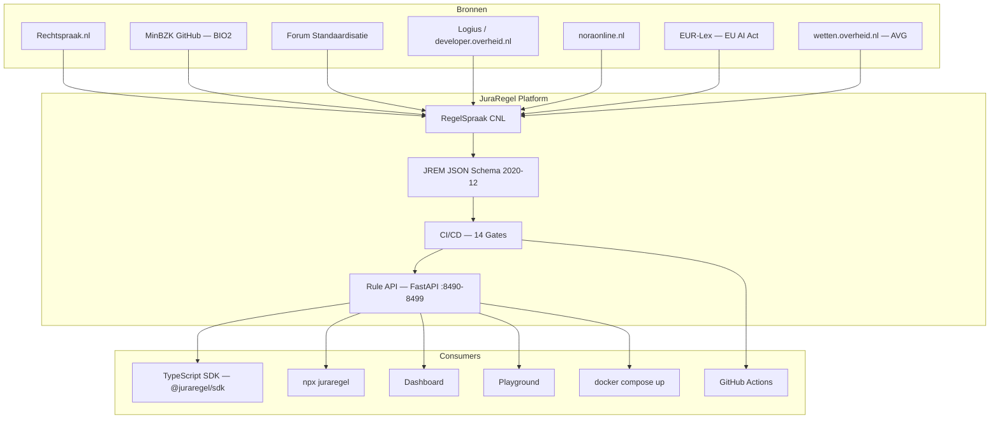

# JuraRegel — Legal RuleOps Platform

[](https://github.com/djimit/juraregel/actions/workflows/juraregel-ci.yml)
[](https://opensource.org/licenses/MIT)
[](https://github.com/djimit/juraregel)
[](https://github.com/djimit/juraregel)
[](https://github.com/djimit/juraregel)
[](https://github.com/djimit/juraregel)
[](https://github.com/djimit/juraregel)
[](https://github.com/djimit/juraregel)
[](https://github.com/djimit/juraregel)

> **Juridische regels die juristen schrijven en computers begrijpen.**
>
> **[🎮 Probeer de Playground](https://djimit.github.io/juraregel/)** — compliance checking in je browser, geen installatie nodig.

JuraRegel is een open-source platform voor het beheren, valideren, versioneren en serveren van administratief-juridische regels. Het vertaalt bijvoorbeeld de [pseudonimiseringsrichtlijn](https://www.rechtspraak.nl/uitspraken/pseudonimiseringsrichtlijn) van Rechtspraak.nl en andere juridische richtlijnen naar digitale, testbare, auditeerbare regels.

> **Disclaimer:** JuraRegel is een proof-of-concept en architectuurprototype. Het is niet geschikt voor productiegebruik als juridisch besluitvormingsplatform zonder onafhankelijke juridische validatie.


<svg xmlns="http://www.w3.org/2000/svg" width="7680" height="4320" viewBox="0 0 7680 4320">
<defs>
  <linearGradient id="bgGrad" x1="0" y1="0" x2="1" y2="1">
    <stop offset="0%" stop-color="#06111F"/>
    <stop offset="55%" stop-color="#0B1F36"/>
    <stop offset="100%" stop-color="#071827"/>
  </linearGradient>
  <radialGradient id="halo" cx="50%" cy="28%" r="70%">
    <stop offset="0%" stop-color="#1A75BB" stop-opacity="0.36"/>
    <stop offset="55%" stop-color="#08375D" stop-opacity="0.12"/>
    <stop offset="100%" stop-color="#06111F" stop-opacity="0"/>
  </radialGradient>
  <linearGradient id="panelGrad" x1="0" y1="0" x2="1" y2="1">
    <stop offset="0%" stop-color="#102D4A" stop-opacity="0.95"/>
    <stop offset="100%" stop-color="#0B2138" stop-opacity="0.92"/>
  </linearGradient>
  <linearGradient id="cardGrad" x1="0" y1="0" x2="1" y2="1">
    <stop offset="0%" stop-color="#173D5F"/>
    <stop offset="100%" stop-color="#0D263F"/>
  </linearGradient>
  <linearGradient id="sourceGrad" x1="0" y1="0" x2="1" y2="1">
    <stop offset="0%" stop-color="#503073"/>
    <stop offset="100%" stop-color="#281B45"/>
  </linearGradient>
  <linearGradient id="businessGrad" x1="0" y1="0" x2="1" y2="1">
    <stop offset="0%" stop-color="#2E5E9E"/>
    <stop offset="100%" stop-color="#173A63"/>
  </linearGradient>
  <linearGradient id="dataGrad" x1="0" y1="0" x2="1" y2="1">
    <stop offset="0%" stop-color="#24767C"/>
    <stop offset="100%" stop-color="#16454D"/>
  </linearGradient>
  <linearGradient id="assuranceGrad" x1="0" y1="0" x2="1" y2="1">
    <stop offset="0%" stop-color="#5B4D8F"/>
    <stop offset="100%" stop-color="#312A5B"/>
  </linearGradient>
  <linearGradient id="apiGrad" x1="0" y1="0" x2="1" y2="1">
    <stop offset="0%" stop-color="#0B7892"/>
    <stop offset="100%" stop-color="#06415B"/>
  </linearGradient>
  <linearGradient id="consumerGrad" x1="0" y1="0" x2="1" y2="1">
    <stop offset="0%" stop-color="#265C8F"/>
    <stop offset="100%" stop-color="#153A61"/>
  </linearGradient>
  <filter id="shadow" x="-20%" y="-20%" width="140%" height="150%">
    <feDropShadow dx="0" dy="18" stdDeviation="20" flood-color="#000000" flood-opacity="0.34"/>
  </filter>
  <filter id="shadowSoft" x="-10%" y="-10%" width="120%" height="130%">
    <feDropShadow dx="0" dy="12" stdDeviation="14" flood-color="#000000" flood-opacity="0.25"/>
  </filter>
  <marker id="arrow" markerWidth="18" markerHeight="18" refX="14" refY="5" orient="auto" markerUnits="strokeWidth">
    <path d="M 0 0 L 14 5 L 0 10 z" fill="#83BFFF"/>
  </marker>
  <marker id="arrowCyan" markerWidth="18" markerHeight="18" refX="14" refY="5" orient="auto" markerUnits="strokeWidth">
    <path d="M 0 0 L 14 5 L 0 10 z" fill="#95E1D3"/>
  </marker>
</defs>

<rect width="7680" height="4320" fill="url(#bgGrad)"/>
<rect width="7680" height="4320" fill="url(#halo)"/>
<line x1="0" y1="0" x2="0" y2="4320" stroke="#18314F" stroke-width="1" opacity="0.18"/>
<line x1="160" y1="0" x2="160" y2="4320" stroke="#18314F" stroke-width="1" opacity="0.18"/>
<line x1="320" y1="0" x2="320" y2="4320" stroke="#18314F" stroke-width="1" opacity="0.18"/>
<line x1="480" y1="0" x2="480" y2="4320" stroke="#18314F" stroke-width="1" opacity="0.18"/>
<line x1="640" y1="0" x2="640" y2="4320" stroke="#18314F" stroke-width="1" opacity="0.18"/>
<line x1="800" y1="0" x2="800" y2="4320" stroke="#18314F" stroke-width="1" opacity="0.18"/>
<line x1="960" y1="0" x2="960" y2="4320" stroke="#18314F" stroke-width="1" opacity="0.18"/>
<line x1="1120" y1="0" x2="1120" y2="4320" stroke="#18314F" stroke-width="1" opacity="0.18"/>
<line x1="1280" y1="0" x2="1280" y2="4320" stroke="#18314F" stroke-width="1" opacity="0.18"/>
<line x1="1440" y1="0" x2="1440" y2="4320" stroke="#18314F" stroke-width="1" opacity="0.18"/>
<line x1="1600" y1="0" x2="1600" y2="4320" stroke="#18314F" stroke-width="1" opacity="0.18"/>
<line x1="1760" y1="0" x2="1760" y2="4320" stroke="#18314F" stroke-width="1" opacity="0.18"/>
<line x1="1920" y1="0" x2="1920" y2="4320" stroke="#18314F" stroke-width="1" opacity="0.18"/>
<line x1="2080" y1="0" x2="2080" y2="4320" stroke="#18314F" stroke-width="1" opacity="0.18"/>
<line x1="2240" y1="0" x2="2240" y2="4320" stroke="#18314F" stroke-width="1" opacity="0.18"/>
<line x1="2400" y1="0" x2="2400" y2="4320" stroke="#18314F" stroke-width="1" opacity="0.18"/>
<line x1="2560" y1="0" x2="2560" y2="4320" stroke="#18314F" stroke-width="1" opacity="0.18"/>
<line x1="2720" y1="0" x2="2720" y2="4320" stroke="#18314F" stroke-width="1" opacity="0.18"/>
<line x1="2880" y1="0" x2="2880" y2="4320" stroke="#18314F" stroke-width="1" opacity="0.18"/>
<line x1="3040" y1="0" x2="3040" y2="4320" stroke="#18314F" stroke-width="1" opacity="0.18"/>
<line x1="3200" y1="0" x2="3200" y2="4320" stroke="#18314F" stroke-width="1" opacity="0.18"/>
<line x1="3360" y1="0" x2="3360" y2="4320" stroke="#18314F" stroke-width="1" opacity="0.18"/>
<line x1="3520" y1="0" x2="3520" y2="4320" stroke="#18314F" stroke-width="1" opacity="0.18"/>
<line x1="3680" y1="0" x2="3680" y2="4320" stroke="#18314F" stroke-width="1" opacity="0.18"/>
<line x1="3840" y1="0" x2="3840" y2="4320" stroke="#18314F" stroke-width="1" opacity="0.18"/>
<line x1="4000" y1="0" x2="4000" y2="4320" stroke="#18314F" stroke-width="1" opacity="0.18"/>
<line x1="4160" y1="0" x2="4160" y2="4320" stroke="#18314F" stroke-width="1" opacity="0.18"/>
<line x1="4320" y1="0" x2="4320" y2="4320" stroke="#18314F" stroke-width="1" opacity="0.18"/>
<line x1="4480" y1="0" x2="4480" y2="4320" stroke="#18314F" stroke-width="1" opacity="0.18"/>
<line x1="4640" y1="0" x2="4640" y2="4320" stroke="#18314F" stroke-width="1" opacity="0.18"/>
<line x1="4800" y1="0" x2="4800" y2="4320" stroke="#18314F" stroke-width="1" opacity="0.18"/>
<line x1="4960" y1="0" x2="4960" y2="4320" stroke="#18314F" stroke-width="1" opacity="0.18"/>
<line x1="5120" y1="0" x2="5120" y2="4320" stroke="#18314F" stroke-width="1" opacity="0.18"/>
<line x1="5280" y1="0" x2="5280" y2="4320" stroke="#18314F" stroke-width="1" opacity="0.18"/>
<line x1="5440" y1="0" x2="5440" y2="4320" stroke="#18314F" stroke-width="1" opacity="0.18"/>
<line x1="5600" y1="0" x2="5600" y2="4320" stroke="#18314F" stroke-width="1" opacity="0.18"/>
<line x1="5760" y1="0" x2="5760" y2="4320" stroke="#18314F" stroke-width="1" opacity="0.18"/>
<line x1="5920" y1="0" x2="5920" y2="4320" stroke="#18314F" stroke-width="1" opacity="0.18"/>
<line x1="6080" y1="0" x2="6080" y2="4320" stroke="#18314F" stroke-width="1" opacity="0.18"/>
<line x1="6240" y1="0" x2="6240" y2="4320" stroke="#18314F" stroke-width="1" opacity="0.18"/>
<line x1="6400" y1="0" x2="6400" y2="4320" stroke="#18314F" stroke-width="1" opacity="0.18"/>
<line x1="6560" y1="0" x2="6560" y2="4320" stroke="#18314F" stroke-width="1" opacity="0.18"/>
<line x1="6720" y1="0" x2="6720" y2="4320" stroke="#18314F" stroke-width="1" opacity="0.18"/>
<line x1="6880" y1="0" x2="6880" y2="4320" stroke="#18314F" stroke-width="1" opacity="0.18"/>
<line x1="7040" y1="0" x2="7040" y2="4320" stroke="#18314F" stroke-width="1" opacity="0.18"/>
<line x1="7200" y1="0" x2="7200" y2="4320" stroke="#18314F" stroke-width="1" opacity="0.18"/>
<line x1="7360" y1="0" x2="7360" y2="4320" stroke="#18314F" stroke-width="1" opacity="0.18"/>
<line x1="7520" y1="0" x2="7520" y2="4320" stroke="#18314F" stroke-width="1" opacity="0.18"/>
<line x1="7680" y1="0" x2="7680" y2="4320" stroke="#18314F" stroke-width="1" opacity="0.18"/>
<line x1="0" y1="0" x2="7680" y2="0" stroke="#18314F" stroke-width="1" opacity="0.18"/>
<line x1="0" y1="160" x2="7680" y2="160" stroke="#18314F" stroke-width="1" opacity="0.18"/>
<line x1="0" y1="320" x2="7680" y2="320" stroke="#18314F" stroke-width="1" opacity="0.18"/>
<line x1="0" y1="480" x2="7680" y2="480" stroke="#18314F" stroke-width="1" opacity="0.18"/>
<line x1="0" y1="640" x2="7680" y2="640" stroke="#18314F" stroke-width="1" opacity="0.18"/>
<line x1="0" y1="800" x2="7680" y2="800" stroke="#18314F" stroke-width="1" opacity="0.18"/>
<line x1="0" y1="960" x2="7680" y2="960" stroke="#18314F" stroke-width="1" opacity="0.18"/>
<line x1="0" y1="1120" x2="7680" y2="1120" stroke="#18314F" stroke-width="1" opacity="0.18"/>
<line x1="0" y1="1280" x2="7680" y2="1280" stroke="#18314F" stroke-width="1" opacity="0.18"/>
<line x1="0" y1="1440" x2="7680" y2="1440" stroke="#18314F" stroke-width="1" opacity="0.18"/>
<line x1="0" y1="1600" x2="7680" y2="1600" stroke="#18314F" stroke-width="1" opacity="0.18"/>
<line x1="0" y1="1760" x2="7680" y2="1760" stroke="#18314F" stroke-width="1" opacity="0.18"/>
<line x1="0" y1="1920" x2="7680" y2="1920" stroke="#18314F" stroke-width="1" opacity="0.18"/>
<line x1="0" y1="2080" x2="7680" y2="2080" stroke="#18314F" stroke-width="1" opacity="0.18"/>
<line x1="0" y1="2240" x2="7680" y2="2240" stroke="#18314F" stroke-width="1" opacity="0.18"/>
<line x1="0" y1="2400" x2="7680" y2="2400" stroke="#18314F" stroke-width="1" opacity="0.18"/>
<line x1="0" y1="2560" x2="7680" y2="2560" stroke="#18314F" stroke-width="1" opacity="0.18"/>
<line x1="0" y1="2720" x2="7680" y2="2720" stroke="#18314F" stroke-width="1" opacity="0.18"/>
<line x1="0" y1="2880" x2="7680" y2="2880" stroke="#18314F" stroke-width="1" opacity="0.18"/>
<line x1="0" y1="3040" x2="7680" y2="3040" stroke="#18314F" stroke-width="1" opacity="0.18"/>
<line x1="0" y1="3200" x2="7680" y2="3200" stroke="#18314F" stroke-width="1" opacity="0.18"/>
<line x1="0" y1="3360" x2="7680" y2="3360" stroke="#18314F" stroke-width="1" opacity="0.18"/>
<line x1="0" y1="3520" x2="7680" y2="3520" stroke="#18314F" stroke-width="1" opacity="0.18"/>
<line x1="0" y1="3680" x2="7680" y2="3680" stroke="#18314F" stroke-width="1" opacity="0.18"/>
<line x1="0" y1="3840" x2="7680" y2="3840" stroke="#18314F" stroke-width="1" opacity="0.18"/>
<line x1="0" y1="4000" x2="7680" y2="4000" stroke="#18314F" stroke-width="1" opacity="0.18"/>
<line x1="0" y1="4160" x2="7680" y2="4160" stroke="#18314F" stroke-width="1" opacity="0.18"/>
<line x1="0" y1="4320" x2="7680" y2="4320" stroke="#18314F" stroke-width="1" opacity="0.18"/>
<line x1="-4320" y1="4320" x2="0" y2="0" stroke="#24405F" stroke-width="1" opacity="0.08"/>
<line x1="-3960" y1="4320" x2="360" y2="0" stroke="#24405F" stroke-width="1" opacity="0.08"/>
<line x1="-3600" y1="4320" x2="720" y2="0" stroke="#24405F" stroke-width="1" opacity="0.08"/>
<line x1="-3240" y1="4320" x2="1080" y2="0" stroke="#24405F" stroke-width="1" opacity="0.08"/>
<line x1="-2880" y1="4320" x2="1440" y2="0" stroke="#24405F" stroke-width="1" opacity="0.08"/>
<line x1="-2520" y1="4320" x2="1800" y2="0" stroke="#24405F" stroke-width="1" opacity="0.08"/>
<line x1="-2160" y1="4320" x2="2160" y2="0" stroke="#24405F" stroke-width="1" opacity="0.08"/>
<line x1="-1800" y1="4320" x2="2520" y2="0" stroke="#24405F" stroke-width="1" opacity="0.08"/>
<line x1="-1440" y1="4320" x2="2880" y2="0" stroke="#24405F" stroke-width="1" opacity="0.08"/>
<line x1="-1080" y1="4320" x2="3240" y2="0" stroke="#24405F" stroke-width="1" opacity="0.08"/>
<line x1="-720" y1="4320" x2="3600" y2="0" stroke="#24405F" stroke-width="1" opacity="0.08"/>
<line x1="-360" y1="4320" x2="3960" y2="0" stroke="#24405F" stroke-width="1" opacity="0.08"/>
<line x1="0" y1="4320" x2="4320" y2="0" stroke="#24405F" stroke-width="1" opacity="0.08"/>
<line x1="360" y1="4320" x2="4680" y2="0" stroke="#24405F" stroke-width="1" opacity="0.08"/>
<line x1="720" y1="4320" x2="5040" y2="0" stroke="#24405F" stroke-width="1" opacity="0.08"/>
<line x1="1080" y1="4320" x2="5400" y2="0" stroke="#24405F" stroke-width="1" opacity="0.08"/>
<line x1="1440" y1="4320" x2="5760" y2="0" stroke="#24405F" stroke-width="1" opacity="0.08"/>
<line x1="1800" y1="4320" x2="6120" y2="0" stroke="#24405F" stroke-width="1" opacity="0.08"/>
<line x1="2160" y1="4320" x2="6480" y2="0" stroke="#24405F" stroke-width="1" opacity="0.08"/>
<line x1="2520" y1="4320" x2="6840" y2="0" stroke="#24405F" stroke-width="1" opacity="0.08"/>
<line x1="2880" y1="4320" x2="7200" y2="0" stroke="#24405F" stroke-width="1" opacity="0.08"/>
<line x1="3240" y1="4320" x2="7560" y2="0" stroke="#24405F" stroke-width="1" opacity="0.08"/>
<line x1="3600" y1="4320" x2="7920" y2="0" stroke="#24405F" stroke-width="1" opacity="0.08"/>
<line x1="3960" y1="4320" x2="8280" y2="0" stroke="#24405F" stroke-width="1" opacity="0.08"/>
<line x1="4320" y1="4320" x2="8640" y2="0" stroke="#24405F" stroke-width="1" opacity="0.08"/>
<line x1="4680" y1="4320" x2="9000" y2="0" stroke="#24405F" stroke-width="1" opacity="0.08"/>
<line x1="5040" y1="4320" x2="9360" y2="0" stroke="#24405F" stroke-width="1" opacity="0.08"/>
<line x1="5400" y1="4320" x2="9720" y2="0" stroke="#24405F" stroke-width="1" opacity="0.08"/>
<line x1="5760" y1="4320" x2="10080" y2="0" stroke="#24405F" stroke-width="1" opacity="0.08"/>
<line x1="6120" y1="4320" x2="10440" y2="0" stroke="#24405F" stroke-width="1" opacity="0.08"/>
<line x1="6480" y1="4320" x2="10800" y2="0" stroke="#24405F" stroke-width="1" opacity="0.08"/>
<line x1="6840" y1="4320" x2="11160" y2="0" stroke="#24405F" stroke-width="1" opacity="0.08"/>
<line x1="7200" y1="4320" x2="11520" y2="0" stroke="#24405F" stroke-width="1" opacity="0.08"/>
<line x1="7560" y1="4320" x2="11880" y2="0" stroke="#24405F" stroke-width="1" opacity="0.08"/>
<text x="220.0" y="230.0" font-family="Inter, Segoe UI, Arial, sans-serif" font-size="96" font-weight="950" fill="#EAF3FF" text-anchor="start" opacity="1.0">
<tspan x="220.0" dy="0.0">JuraRegel</tspan>
</text>
<text x="220.0" y="320.0" font-family="Inter, Segoe UI, Arial, sans-serif" font-size="70" font-weight="850" fill="#64D2FF" text-anchor="start" opacity="1.0">
<tspan x="220.0" dy="0.0">TOGAF Enterprise Architecture Landscape</tspan>
</text>
<text x="220.0" y="386.0" font-family="Inter, Segoe UI, Arial, sans-serif" font-size="34" font-weight="450" fill="#C8D7E8" text-anchor="start" opacity="1.0">
<tspan x="220.0" dy="0.0">Legal RuleOps platform: from authoritative legal sources to explainable, testable, auditable Rule APIs</tspan>
</text>
<rect x="5750" y="170" width="420" height="48" rx="24" fill="#113A58" stroke="#4BA3D8" stroke-width="2" opacity="0.97"/>
<text x="5960.0" y="202.0" font-family="Inter, Segoe UI, Arial, sans-serif" font-size="26" font-weight="700" fill="#EAF3FF" text-anchor="middle" opacity="1.0">
<tspan x="5960.0" dy="0.0">View: Landscape</tspan>
</text>
<rect x="6200" y="170" width="560" height="48" rx="24" fill="#113A58" stroke="#4BA3D8" stroke-width="2" opacity="0.97"/>
<text x="6480.0" y="202.0" font-family="Inter, Segoe UI, Arial, sans-serif" font-size="26" font-weight="700" fill="#EAF3FF" text-anchor="middle" opacity="1.0">
<tspan x="6480.0" dy="0.0">Scope: Conceptual + Logical</tspan>
</text>
<rect x="6800" y="170" width="470" height="48" rx="24" fill="#113A58" stroke="#4BA3D8" stroke-width="2" opacity="0.97"/>
<text x="7035.0" y="202.0" font-family="Inter, Segoe UI, Arial, sans-serif" font-size="26" font-weight="700" fill="#EAF3FF" text-anchor="middle" opacity="1.0">
<tspan x="7035.0" dy="0.0">Format: 7680 x 4320</tspan>
</text>
<rect x="220" y="470" width="1370" height="86" rx="28" fill="#2B4C7E" stroke="#80B7E6" stroke-width="2" opacity="0.82"/>
<text x="905.0" y="527.0" font-family="Inter, Segoe UI, Arial, sans-serif" font-size="32" font-weight="850" fill="#FFFFFF" text-anchor="middle" opacity="1.0">
<tspan x="905.0" dy="0.0">Business Architecture</tspan>
</text>
<rect x="1670" y="470" width="1370" height="86" rx="28" fill="#205E67" stroke="#80B7E6" stroke-width="2" opacity="0.82"/>
<text x="2355.0" y="527.0" font-family="Inter, Segoe UI, Arial, sans-serif" font-size="32" font-weight="850" fill="#FFFFFF" text-anchor="middle" opacity="1.0">
<tspan x="2355.0" dy="0.0">Data Architecture</tspan>
</text>
<rect x="3120" y="470" width="1370" height="86" rx="28" fill="#154C79" stroke="#80B7E6" stroke-width="2" opacity="0.82"/>
<text x="3805.0" y="527.0" font-family="Inter, Segoe UI, Arial, sans-serif" font-size="32" font-weight="850" fill="#FFFFFF" text-anchor="middle" opacity="1.0">
<tspan x="3805.0" dy="0.0">Application Architecture</tspan>
</text>
<rect x="4570" y="470" width="1370" height="86" rx="28" fill="#54457A" stroke="#80B7E6" stroke-width="2" opacity="0.82"/>
<text x="5255.0" y="527.0" font-family="Inter, Segoe UI, Arial, sans-serif" font-size="32" font-weight="850" fill="#FFFFFF" text-anchor="middle" opacity="1.0">
<tspan x="5255.0" dy="0.0">Technology Architecture</tspan>
</text>
<rect x="6020" y="470" width="1370" height="86" rx="28" fill="#5B3B2E" stroke="#80B7E6" stroke-width="2" opacity="0.82"/>
<text x="6705.0" y="527.0" font-family="Inter, Segoe UI, Arial, sans-serif" font-size="32" font-weight="850" fill="#FFFFFF" text-anchor="middle" opacity="1.0">
<tspan x="6705.0" dy="0.0">Governance and Security</tspan>
</text>
<rect x="220" y="700" width="1580" height="2160" rx="46" fill="url(#panelGrad)" stroke="#8E63C7" stroke-width="4" opacity="0.93" filter="url(#shadowSoft)"/>
<text x="262.0" y="772.0" font-family="Inter, Segoe UI, Arial, sans-serif" font-size="44" font-weight="900" fill="#EAF3FF" text-anchor="start" opacity="1.0">
<tspan x="262.0" dy="0.0">External Legal and Regulatory Sources</tspan>
</text>
<text x="262.0" y="818.0" font-family="Inter, Segoe UI, Arial, sans-serif" font-size="25" font-weight="400" fill="#8EA8C3" text-anchor="start" opacity="1.0">
<tspan x="262.0" dy="0.0">Authoritative inputs for rule capture and traceable interpretation</tspan>
</text>
<rect x="1980" y="700" width="3540" height="2160" rx="46" fill="url(#panelGrad)" stroke="#52A9D4" stroke-width="4" opacity="0.93" filter="url(#shadowSoft)"/>
<text x="2022.0" y="772.0" font-family="Inter, Segoe UI, Arial, sans-serif" font-size="44" font-weight="900" fill="#EAF3FF" text-anchor="start" opacity="1.0">
<tspan x="2022.0" dy="0.0">JuraRegel Platform</tspan>
</text>
<text x="2022.0" y="818.0" font-family="Inter, Segoe UI, Arial, sans-serif" font-size="25" font-weight="400" fill="#8EA8C3" text-anchor="start" opacity="1.0">
<tspan x="2022.0" dy="0.0">Controlled language, open rule model, assurance pipeline and API service layer</tspan>
</text>
<rect x="5700" y="700" width="1760" height="2160" rx="46" fill="url(#panelGrad)" stroke="#5FBCEB" stroke-width="4" opacity="0.93" filter="url(#shadowSoft)"/>
<text x="5742.0" y="772.0" font-family="Inter, Segoe UI, Arial, sans-serif" font-size="44" font-weight="900" fill="#EAF3FF" text-anchor="start" opacity="1.0">
<tspan x="5742.0" dy="0.0">Consumers and Delivery Channels</tspan>
</text>
<text x="5742.0" y="818.0" font-family="Inter, Segoe UI, Arial, sans-serif" font-size="25" font-weight="400" fill="#8EA8C3" text-anchor="start" opacity="1.0">
<tspan x="5742.0" dy="0.0">Developer, operational and presentation access to validated rule services</tspan>
</text>
<rect x="220" y="3010" width="7240" height="940" rx="46" fill="url(#panelGrad)" stroke="#CAA45E" stroke-width="4" opacity="0.93" filter="url(#shadowSoft)"/>
<text x="262.0" y="3082.0" font-family="Inter, Segoe UI, Arial, sans-serif" font-size="44" font-weight="900" fill="#EAF3FF" text-anchor="start" opacity="1.0">
<tspan x="262.0" dy="0.0">Cross-cutting Enterprise Guardrails</tspan>
</text>
<text x="262.0" y="3128.0" font-family="Inter, Segoe UI, Arial, sans-serif" font-size="25" font-weight="400" fill="#8EA8C3" text-anchor="start" opacity="1.0">
<tspan x="262.0" dy="0.0">TOGAF requirements management, architecture governance, security, privacy, operations and legal assurance</tspan>
</text>
<rect x="292" y="890" width="690" height="224" rx="34" fill="url(#sourceGrad)" stroke="#A579D2" stroke-width="3" opacity="1" filter="url(#shadow)"/>
<circle cx="346" cy="944" r="27" fill="#764EA8" opacity="0.92"/>
<text x="346.0" y="955.0" font-family="Segoe UI Symbol, Arial, sans-serif" font-size="30" font-weight="800" fill="#FFFFFF" text-anchor="middle" opacity="1.0">
<tspan x="346.0" dy="0.0">§</tspan>
</text>
<text x="390.0" y="950.0" font-family="Inter, Segoe UI, Arial, sans-serif" font-size="38" font-weight="800" fill="#EAF3FF" text-anchor="start" opacity="1.0">
<tspan x="390.0" dy="0.0">Rechtspraak.nl</tspan>
</text>
<text x="334.0" y="1014.0" font-family="Inter, Segoe UI, Arial, sans-serif" font-size="26" font-weight="400" fill="#C8D7E8" text-anchor="start" opacity="1.0">
<tspan x="334.0" dy="0.0">Pseudonymisation guidance and case</tspan>
<tspan x="334.0" dy="31.2">publication context</tspan>
</text>
<rect x="738" y="918" width="210" height="44" rx="22" fill="#764EA8" opacity="0.90"/>
<text x="843.0" y="949.0" font-family="Inter, Segoe UI, Arial, sans-serif" font-size="22" font-weight="800" fill="#FFFFFF" text-anchor="middle" opacity="1.0">
<tspan x="843.0" dy="0.0">LEGAL</tspan>
</text>
<rect x="1046" y="890" width="690" height="224" rx="34" fill="url(#sourceGrad)" stroke="#A579D2" stroke-width="3" opacity="1" filter="url(#shadow)"/>
<circle cx="1100" cy="944" r="27" fill="#764EA8" opacity="0.92"/>
<text x="1100.0" y="955.0" font-family="Segoe UI Symbol, Arial, sans-serif" font-size="30" font-weight="800" fill="#FFFFFF" text-anchor="middle" opacity="1.0">
<tspan x="1100.0" dy="0.0">§</tspan>
</text>
<text x="1144.0" y="950.0" font-family="Inter, Segoe UI, Arial, sans-serif" font-size="38" font-weight="800" fill="#EAF3FF" text-anchor="start" opacity="1.0">
<tspan x="1144.0" dy="0.0">MinBZK GitHub: BIO2</tspan>
</text>
<text x="1088.0" y="1014.0" font-family="Inter, Segoe UI, Arial, sans-serif" font-size="26" font-weight="400" fill="#C8D7E8" text-anchor="start" opacity="1.0">
<tspan x="1088.0" dy="0.0">Baseline information security controls for</tspan>
<tspan x="1088.0" dy="31.2">government</tspan>
</text>
<rect x="1492" y="918" width="210" height="44" rx="22" fill="#764EA8" opacity="0.90"/>
<text x="1597.0" y="949.0" font-family="Inter, Segoe UI, Arial, sans-serif" font-size="22" font-weight="800" fill="#FFFFFF" text-anchor="middle" opacity="1.0">
<tspan x="1597.0" dy="0.0">BIO2</tspan>
</text>
<rect x="292" y="1188" width="690" height="224" rx="34" fill="url(#sourceGrad)" stroke="#A579D2" stroke-width="3" opacity="1" filter="url(#shadow)"/>
<circle cx="346" cy="1242" r="27" fill="#764EA8" opacity="0.92"/>
<text x="346.0" y="1253.0" font-family="Segoe UI Symbol, Arial, sans-serif" font-size="30" font-weight="800" fill="#FFFFFF" text-anchor="middle" opacity="1.0">
<tspan x="346.0" dy="0.0">§</tspan>
</text>
<text x="390.0" y="1248.0" font-family="Inter, Segoe UI, Arial, sans-serif" font-size="38" font-weight="800" fill="#EAF3FF" text-anchor="start" opacity="1.0">
<tspan x="390.0" dy="0.0">Forum Standaardisatie</tspan>
</text>
<text x="334.0" y="1312.0" font-family="Inter, Segoe UI, Arial, sans-serif" font-size="26" font-weight="400" fill="#C8D7E8" text-anchor="start" opacity="1.0">
<tspan x="334.0" dy="0.0">Mandatory open standards and</tspan>
<tspan x="334.0" dy="31.2">interoperability lists</tspan>
</text>
<rect x="738" y="1216" width="210" height="44" rx="22" fill="#764EA8" opacity="0.90"/>
<text x="843.0" y="1247.0" font-family="Inter, Segoe UI, Arial, sans-serif" font-size="22" font-weight="800" fill="#FFFFFF" text-anchor="middle" opacity="1.0">
<tspan x="843.0" dy="0.0">STD</tspan>
</text>
<rect x="1046" y="1188" width="690" height="224" rx="34" fill="url(#sourceGrad)" stroke="#A579D2" stroke-width="3" opacity="1" filter="url(#shadow)"/>
<circle cx="1100" cy="1242" r="27" fill="#764EA8" opacity="0.92"/>
<text x="1100.0" y="1253.0" font-family="Segoe UI Symbol, Arial, sans-serif" font-size="30" font-weight="800" fill="#FFFFFF" text-anchor="middle" opacity="1.0">
<tspan x="1100.0" dy="0.0">§</tspan>
</text>
<text x="1144.0" y="1248.0" font-family="Inter, Segoe UI, Arial, sans-serif" font-size="38" font-weight="800" fill="#EAF3FF" text-anchor="start" opacity="1.0">
<tspan x="1144.0" dy="0.0">Logius /</tspan>
<tspan x="1144.0" dy="42.6">developer.overheid.nl</tspan>
</text>
<text x="1088.0" y="1312.0" font-family="Inter, Segoe UI, Arial, sans-serif" font-size="26" font-weight="400" fill="#C8D7E8" text-anchor="start" opacity="1.0">
<tspan x="1088.0" dy="0.0">API design rules, OAuth/OIDC, events and</tspan>
<tspan x="1088.0" dy="31.2">Digikoppeling</tspan>
</text>
<rect x="1492" y="1216" width="210" height="44" rx="22" fill="#764EA8" opacity="0.90"/>
<text x="1597.0" y="1247.0" font-family="Inter, Segoe UI, Arial, sans-serif" font-size="22" font-weight="800" fill="#FFFFFF" text-anchor="middle" opacity="1.0">
<tspan x="1597.0" dy="0.0">API</tspan>
</text>
<rect x="292" y="1486" width="690" height="224" rx="34" fill="url(#sourceGrad)" stroke="#A579D2" stroke-width="3" opacity="1" filter="url(#shadow)"/>
<circle cx="346" cy="1540" r="27" fill="#764EA8" opacity="0.92"/>
<text x="346.0" y="1551.0" font-family="Segoe UI Symbol, Arial, sans-serif" font-size="30" font-weight="800" fill="#FFFFFF" text-anchor="middle" opacity="1.0">
<tspan x="346.0" dy="0.0">§</tspan>
</text>
<text x="390.0" y="1546.0" font-family="Inter, Segoe UI, Arial, sans-serif" font-size="38" font-weight="800" fill="#EAF3FF" text-anchor="start" opacity="1.0">
<tspan x="390.0" dy="0.0">noraonline.nl</tspan>
</text>
<text x="334.0" y="1610.0" font-family="Inter, Segoe UI, Arial, sans-serif" font-size="26" font-weight="400" fill="#C8D7E8" text-anchor="start" opacity="1.0">
<tspan x="334.0" dy="0.0">NORA principles and public-sector</tspan>
<tspan x="334.0" dy="31.2">architecture alignment</tspan>
</text>
<rect x="738" y="1514" width="210" height="44" rx="22" fill="#764EA8" opacity="0.90"/>
<text x="843.0" y="1545.0" font-family="Inter, Segoe UI, Arial, sans-serif" font-size="22" font-weight="800" fill="#FFFFFF" text-anchor="middle" opacity="1.0">
<tspan x="843.0" dy="0.0">NORA</tspan>
</text>
<rect x="1046" y="1486" width="690" height="224" rx="34" fill="url(#sourceGrad)" stroke="#A579D2" stroke-width="3" opacity="1" filter="url(#shadow)"/>
<circle cx="1100" cy="1540" r="27" fill="#764EA8" opacity="0.92"/>
<text x="1100.0" y="1551.0" font-family="Segoe UI Symbol, Arial, sans-serif" font-size="30" font-weight="800" fill="#FFFFFF" text-anchor="middle" opacity="1.0">
<tspan x="1100.0" dy="0.0">§</tspan>
</text>
<text x="1144.0" y="1546.0" font-family="Inter, Segoe UI, Arial, sans-serif" font-size="38" font-weight="800" fill="#EAF3FF" text-anchor="start" opacity="1.0">
<tspan x="1144.0" dy="0.0">EUR-Lex: EU AI Act</tspan>
</text>
<text x="1088.0" y="1610.0" font-family="Inter, Segoe UI, Arial, sans-serif" font-size="26" font-weight="400" fill="#C8D7E8" text-anchor="start" opacity="1.0">
<tspan x="1088.0" dy="0.0">European AI compliance obligations and</tspan>
<tspan x="1088.0" dy="31.2">risk classification</tspan>
</text>
<rect x="1492" y="1514" width="210" height="44" rx="22" fill="#764EA8" opacity="0.90"/>
<text x="1597.0" y="1545.0" font-family="Inter, Segoe UI, Arial, sans-serif" font-size="22" font-weight="800" fill="#FFFFFF" text-anchor="middle" opacity="1.0">
<tspan x="1597.0" dy="0.0">AI</tspan>
</text>
<rect x="642" y="1784" width="690" height="224" rx="34" fill="url(#sourceGrad)" stroke="#A579D2" stroke-width="3" opacity="1" filter="url(#shadow)"/>
<circle cx="696" cy="1838" r="27" fill="#764EA8" opacity="0.92"/>
<text x="696.0" y="1849.0" font-family="Segoe UI Symbol, Arial, sans-serif" font-size="30" font-weight="800" fill="#FFFFFF" text-anchor="middle" opacity="1.0">
<tspan x="696.0" dy="0.0">§</tspan>
</text>
<text x="740.0" y="1844.0" font-family="Inter, Segoe UI, Arial, sans-serif" font-size="38" font-weight="800" fill="#EAF3FF" text-anchor="start" opacity="1.0">
<tspan x="740.0" dy="0.0">wetten.overheid.nl: AVG</tspan>
</text>
<text x="684.0" y="1908.0" font-family="Inter, Segoe UI, Arial, sans-serif" font-size="26" font-weight="400" fill="#C8D7E8" text-anchor="start" opacity="1.0">
<tspan x="684.0" dy="0.0">Privacy law, DPIA, minimisation and data</tspan>
<tspan x="684.0" dy="31.2">subject rights</tspan>
</text>
<rect x="1088" y="1812" width="210" height="44" rx="22" fill="#764EA8" opacity="0.90"/>
<text x="1193.0" y="1843.0" font-family="Inter, Segoe UI, Arial, sans-serif" font-size="22" font-weight="800" fill="#FFFFFF" text-anchor="middle" opacity="1.0">
<tspan x="1193.0" dy="0.0">AVG</tspan>
</text>
<circle cx="1712" cy="1790.0" r="52" fill="#6E4EA4" stroke="#CAAEFF" stroke-width="4" opacity="0.96" filter="url(#shadow)"/>
<text x="1712.0" y="1803.0" font-family="Inter, Segoe UI, Arial, sans-serif" font-size="32" font-weight="900" fill="#FFFFFF" text-anchor="middle" opacity="1.0">
<tspan x="1712.0" dy="0.0">IN</tspan>
</text>
<path d="M 982 1002.0 C 1072 1002.0, 1597 1790.0, 1654 1790.0" stroke="#B790EE" stroke-width="3.6" opacity="0.55" fill="none" stroke-linecap="round" stroke-linejoin="round"/>
<path d="M 1736 1002.0 C 1826 1002.0, 1597 1790.0, 1654 1790.0" stroke="#B790EE" stroke-width="3.6" opacity="0.55" fill="none" stroke-linecap="round" stroke-linejoin="round"/>
<path d="M 982 1300.0 C 1072 1300.0, 1597 1790.0, 1654 1790.0" stroke="#B790EE" stroke-width="3.6" opacity="0.55" fill="none" stroke-linecap="round" stroke-linejoin="round"/>
<path d="M 1736 1300.0 C 1826 1300.0, 1597 1790.0, 1654 1790.0" stroke="#B790EE" stroke-width="3.6" opacity="0.55" fill="none" stroke-linecap="round" stroke-linejoin="round"/>
<path d="M 982 1598.0 C 1072 1598.0, 1597 1790.0, 1654 1790.0" stroke="#B790EE" stroke-width="3.6" opacity="0.55" fill="none" stroke-linecap="round" stroke-linejoin="round"/>
<path d="M 1736 1598.0 C 1826 1598.0, 1597 1790.0, 1654 1790.0" stroke="#B790EE" stroke-width="3.6" opacity="0.55" fill="none" stroke-linecap="round" stroke-linejoin="round"/>
<path d="M 1332 1896.0 C 1422 1896.0, 1597 1790.0, 1654 1790.0" stroke="#B790EE" stroke-width="3.6" opacity="0.55" fill="none" stroke-linecap="round" stroke-linejoin="round"/>
<rect x="2130" y="1000" width="760" height="360" rx="34" fill="url(#businessGrad)" stroke="#79B9FF" stroke-width="3" opacity="1" filter="url(#shadow)"/>
<circle cx="2184" cy="1054" r="27" fill="#79B9FF" opacity="0.92"/>
<text x="2184.0" y="1065.0" font-family="Segoe UI Symbol, Arial, sans-serif" font-size="30" font-weight="800" fill="#FFFFFF" text-anchor="middle" opacity="1.0">
<tspan x="2184.0" dy="0.0">B</tspan>
</text>
<text x="2228.0" y="1060.0" font-family="Inter, Segoe UI, Arial, sans-serif" font-size="38" font-weight="800" fill="#EAF3FF" text-anchor="start" opacity="1.0">
<tspan x="2228.0" dy="0.0">RegelSpraak CNL</tspan>
</text>
<text x="2172.0" y="1124.0" font-family="Inter, Segoe UI, Arial, sans-serif" font-size="26" font-weight="400" fill="#C8D7E8" text-anchor="start" opacity="1.0">
<tspan x="2172.0" dy="0.0">Business and legal rule authoring layer.</tspan>
<tspan x="2172.0" dy="31.2">Jurist-readable controlled natural language</tspan>
<tspan x="2172.0" dy="31.2">becomes structured rule intent.</tspan>
</text>
<rect x="2646" y="1028" width="210" height="44" rx="22" fill="#79B9FF" opacity="0.90"/>
<text x="2751.0" y="1059.0" font-family="Inter, Segoe UI, Arial, sans-serif" font-size="22" font-weight="800" fill="#FFFFFF" text-anchor="middle" opacity="1.0">
<tspan x="2751.0" dy="0.0">Business</tspan>
</text>
<rect x="2985" y="1000" width="760" height="360" rx="34" fill="url(#dataGrad)" stroke="#74E4DF" stroke-width="3" opacity="1" filter="url(#shadow)"/>
<circle cx="3039" cy="1054" r="27" fill="#74E4DF" opacity="0.92"/>
<text x="3039.0" y="1065.0" font-family="Segoe UI Symbol, Arial, sans-serif" font-size="30" font-weight="800" fill="#FFFFFF" text-anchor="middle" opacity="1.0">
<tspan x="3039.0" dy="0.0">D</tspan>
</text>
<text x="3083.0" y="1060.0" font-family="Inter, Segoe UI, Arial, sans-serif" font-size="38" font-weight="800" fill="#EAF3FF" text-anchor="start" opacity="1.0">
<tspan x="3083.0" dy="0.0">JREM JSON Schema 2020-12</tspan>
</text>
<text x="3027.0" y="1124.0" font-family="Inter, Segoe UI, Arial, sans-serif" font-size="26" font-weight="400" fill="#C8D7E8" text-anchor="start" opacity="1.0">
<tspan x="3027.0" dy="0.0">Data architecture for rules. Versioned JSON</tspan>
<tspan x="3027.0" dy="31.2">Schema, source references, scenarios, validity</tspan>
<tspan x="3027.0" dy="31.2">periods and metadata.</tspan>
</text>
<rect x="3501" y="1028" width="210" height="44" rx="22" fill="#74E4DF" opacity="0.90"/>
<text x="3606.0" y="1059.0" font-family="Inter, Segoe UI, Arial, sans-serif" font-size="22" font-weight="800" fill="#FFFFFF" text-anchor="middle" opacity="1.0">
<tspan x="3606.0" dy="0.0">Data</tspan>
</text>
<rect x="3840" y="1000" width="760" height="360" rx="34" fill="url(#assuranceGrad)" stroke="#B8A8FF" stroke-width="3" opacity="1" filter="url(#shadow)"/>
<circle cx="3894" cy="1054" r="27" fill="#B8A8FF" opacity="0.92"/>
<text x="3894.0" y="1065.0" font-family="Segoe UI Symbol, Arial, sans-serif" font-size="30" font-weight="800" fill="#FFFFFF" text-anchor="middle" opacity="1.0">
<tspan x="3894.0" dy="0.0">G</tspan>
</text>
<text x="3938.0" y="1060.0" font-family="Inter, Segoe UI, Arial, sans-serif" font-size="38" font-weight="800" fill="#EAF3FF" text-anchor="start" opacity="1.0">
<tspan x="3938.0" dy="0.0">CI/CD: 14 Gates</tspan>
</text>
<text x="3882.0" y="1124.0" font-family="Inter, Segoe UI, Arial, sans-serif" font-size="26" font-weight="400" fill="#C8D7E8" text-anchor="start" opacity="1.0">
<tspan x="3882.0" dy="0.0">Assurance workflow. Schema validation, tests,</tspan>
<tspan x="3882.0" dy="31.2">maturity checks, acceptance gates and</tspan>
<tspan x="3882.0" dy="31.2">repeatable delivery controls.</tspan>
</text>
<rect x="4356" y="1028" width="210" height="44" rx="22" fill="#B8A8FF" opacity="0.90"/>
<text x="4461.0" y="1059.0" font-family="Inter, Segoe UI, Arial, sans-serif" font-size="22" font-weight="800" fill="#FFFFFF" text-anchor="middle" opacity="1.0">
<tspan x="4461.0" dy="0.0">Assurance</tspan>
</text>
<rect x="4695" y="1000" width="760" height="360" rx="34" fill="url(#apiGrad)" stroke="#81E6FF" stroke-width="3" opacity="1" filter="url(#shadow)"/>
<circle cx="4749" cy="1054" r="27" fill="#81E6FF" opacity="0.92"/>
<text x="4749.0" y="1065.0" font-family="Segoe UI Symbol, Arial, sans-serif" font-size="30" font-weight="800" fill="#FFFFFF" text-anchor="middle" opacity="1.0">
<tspan x="4749.0" dy="0.0">A</tspan>
</text>
<text x="4793.0" y="1060.0" font-family="Inter, Segoe UI, Arial, sans-serif" font-size="38" font-weight="800" fill="#EAF3FF" text-anchor="start" opacity="1.0">
<tspan x="4793.0" dy="0.0">Rule API: FastAPI :8490-8499</tspan>
</text>
<text x="4737.0" y="1124.0" font-family="Inter, Segoe UI, Arial, sans-serif" font-size="26" font-weight="400" fill="#C8D7E8" text-anchor="start" opacity="1.0">
<tspan x="4737.0" dy="0.0">Application services. Stateless rule execution</tspan>
<tspan x="4737.0" dy="31.2">with explanation, results, warnings and audit</tspan>
<tspan x="4737.0" dy="31.2">metadata.</tspan>
</text>
<rect x="5189" y="1028" width="232" height="44" rx="22" fill="#81E6FF" opacity="0.90"/>
<text x="5305.0" y="1059.0" font-family="Inter, Segoe UI, Arial, sans-serif" font-size="22" font-weight="800" fill="#FFFFFF" text-anchor="middle" opacity="1.0">
<tspan x="5305.0" dy="0.0">Application</tspan>
</text>
<line x1="2902" y1="1180.0" x2="2963" y2="1180.0" stroke="#83BFFF" stroke-width="8" opacity="0.95" fill="none" stroke-linecap="round" marker-end="url(#arrow)"/>
<line x1="3757" y1="1180.0" x2="3818" y2="1180.0" stroke="#83BFFF" stroke-width="8" opacity="0.95" fill="none" stroke-linecap="round" marker-end="url(#arrow)"/>
<line x1="4612" y1="1180.0" x2="4673" y2="1180.0" stroke="#83BFFF" stroke-width="8" opacity="0.95" fill="none" stroke-linecap="round" marker-end="url(#arrow)"/>
<line x1="1772" y1="1790.0" x2="2088" y2="1180.0" stroke="#B790EE" stroke-width="8" opacity="0.9" fill="none" stroke-linecap="round" marker-end="url(#arrow)"/>
<text x="2020.0" y="912.0" font-family="Inter, Segoe UI, Arial, sans-serif" font-size="34" font-weight="850" fill="#64D2FF" text-anchor="start" opacity="1.0">
<tspan x="2020.0" dy="0.0">Core value stream</tspan>
</text>
<text x="2020.0" y="958.0" font-family="Inter, Segoe UI, Arial, sans-serif" font-size="24" font-weight="450" fill="#C8D7E8" text-anchor="start" opacity="1.0">
<tspan x="2020.0" dy="0.0">source interpretation -&gt; controlled rule language -&gt; open rule model -&gt; gated delivery -&gt; executable rule service</tspan>
</text>
<rect x="2130" y="1520" width="1540" height="650" rx="38" fill="#0D3140" stroke="#3EC6C9" stroke-width="3" opacity="0.96" filter="url(#shadowSoft)"/>
<text x="2170.0" y="1582.0" font-family="Inter, Segoe UI, Arial, sans-serif" font-size="38" font-weight="900" fill="#EAF3FF" text-anchor="start" opacity="1.0">
<tspan x="2170.0" dy="0.0">Rule Data Model Detail</tspan>
</text>
<circle cx="2196" cy="1640" r="10" fill="#95E1D3"/>
<text x="2226.0" y="1650.0" font-family="Inter, Segoe UI, Arial, sans-serif" font-size="29" font-weight="520" fill="#C8D7E8" text-anchor="start" opacity="1.0">
<tspan x="2226.0" dy="0.0">conditions and outcomes</tspan>
</text>
<circle cx="2196" cy="1726" r="10" fill="#95E1D3"/>
<text x="2226.0" y="1736.0" font-family="Inter, Segoe UI, Arial, sans-serif" font-size="29" font-weight="520" fill="#C8D7E8" text-anchor="start" opacity="1.0">
<tspan x="2226.0" dy="0.0">sourceRefs for legal traceability</tspan>
</text>
<circle cx="2196" cy="1812" r="10" fill="#95E1D3"/>
<text x="2226.0" y="1822.0" font-family="Inter, Segoe UI, Arial, sans-serif" font-size="29" font-weight="520" fill="#C8D7E8" text-anchor="start" opacity="1.0">
<tspan x="2226.0" dy="0.0">embedded test scenarios</tspan>
</text>
<circle cx="2196" cy="1898" r="10" fill="#95E1D3"/>
<text x="2226.0" y="1908.0" font-family="Inter, Segoe UI, Arial, sans-serif" font-size="29" font-weight="520" fill="#C8D7E8" text-anchor="start" opacity="1.0">
<tspan x="2226.0" dy="0.0">version and validity period</tspan>
</text>
<circle cx="2196" cy="1984" r="10" fill="#95E1D3"/>
<text x="2226.0" y="1994.0" font-family="Inter, Segoe UI, Arial, sans-serif" font-size="29" font-weight="520" fill="#C8D7E8" text-anchor="start" opacity="1.0">
<tspan x="2226.0" dy="0.0">juridical context metadata</tspan>
</text>
<rect x="3820" y="1520" width="1510" height="650" rx="38" fill="#221F4E" stroke="#B8A8FF" stroke-width="3" opacity="0.96" filter="url(#shadowSoft)"/>
<text x="3860.0" y="1582.0" font-family="Inter, Segoe UI, Arial, sans-serif" font-size="38" font-weight="900" fill="#EAF3FF" text-anchor="start" opacity="1.0">
<tspan x="3860.0" dy="0.0">Architecture Governance Detail</tspan>
</text>
<circle cx="3886" cy="1640" r="10" fill="#B8A8FF"/>
<text x="3916.0" y="1650.0" font-family="Inter, Segoe UI, Arial, sans-serif" font-size="29" font-weight="520" fill="#C8D7E8" text-anchor="start" opacity="1.0">
<tspan x="3916.0" dy="0.0">schema validation before runtime</tspan>
</text>
<circle cx="3886" cy="1726" r="10" fill="#B8A8FF"/>
<text x="3916.0" y="1736.0" font-family="Inter, Segoe UI, Arial, sans-serif" font-size="29" font-weight="520" fill="#C8D7E8" text-anchor="start" opacity="1.0">
<tspan x="3916.0" dy="0.0">automated tests and quality gates</tspan>
</text>
<circle cx="3886" cy="1812" r="10" fill="#B8A8FF"/>
<text x="3916.0" y="1822.0" font-family="Inter, Segoe UI, Arial, sans-serif" font-size="29" font-weight="520" fill="#C8D7E8" text-anchor="start" opacity="1.0">
<tspan x="3916.0" dy="0.0">maturity signal per use case</tspan>
</text>
<circle cx="3886" cy="1898" r="10" fill="#B8A8FF"/>
<text x="3916.0" y="1908.0" font-family="Inter, Segoe UI, Arial, sans-serif" font-size="29" font-weight="520" fill="#C8D7E8" text-anchor="start" opacity="1.0">
<tspan x="3916.0" dy="0.0">manual review path for exceptions</tspan>
</text>
<circle cx="3886" cy="1984" r="10" fill="#B8A8FF"/>
<text x="3916.0" y="1994.0" font-family="Inter, Segoe UI, Arial, sans-serif" font-size="29" font-weight="520" fill="#C8D7E8" text-anchor="start" opacity="1.0">
<tspan x="3916.0" dy="0.0">GitHub Actions integration</tspan>
</text>
<rect x="2130" y="2290" width="3200" height="1090" rx="44" fill="#0A273C" stroke="#44C1EB" stroke-width="3" opacity="0.96" filter="url(#shadowSoft)"/>
<text x="2174.0" y="2358.0" font-family="Inter, Segoe UI, Arial, sans-serif" font-size="42" font-weight="900" fill="#EAF3FF" text-anchor="start" opacity="1.0">
<tspan x="2174.0" dy="0.0">Rule API Fleet and Domain Services</tspan>
</text>
<text x="2174.0" y="2402.0" font-family="Inter, Segoe UI, Arial, sans-serif" font-size="25" font-weight="450" fill="#C8D7E8" text-anchor="start" opacity="1.0">
<tspan x="2174.0" dy="0.0">Logical service decomposition: one rule API per legal or compliance domain, uniform contract and runtime pattern</tspan>
</text>
<rect x="2186" y="2480" width="585" height="130" rx="26" fill="#113A58" stroke="#4CAFE2" stroke-width="2.5" opacity="0.98"/>
<text x="2220.0" y="2534.0" font-family="Inter, Segoe UI, Arial, sans-serif" font-size="28" font-weight="850" fill="#EAF3FF" text-anchor="start" opacity="1.0">
<tspan x="2220.0" dy="0.0">griffierecht</tspan>
</text>
<rect x="2633" y="2510" width="104" height="56" rx="18" fill="#0B7892" stroke="#86EBFF" stroke-width="2"/>
<text x="2685.0" y="2548.0" font-family="Inter, Segoe UI, Arial, sans-serif" font-size="25" font-weight="900" fill="#FFFFFF" text-anchor="middle" opacity="1.0">
<tspan x="2685.0" dy="0.0">:8490</tspan>
</text>
<rect x="2813" y="2480" width="585" height="130" rx="26" fill="#113A58" stroke="#4CAFE2" stroke-width="2.5" opacity="0.98"/>
<text x="2847.0" y="2534.0" font-family="Inter, Segoe UI, Arial, sans-serif" font-size="28" font-weight="850" fill="#EAF3FF" text-anchor="start" opacity="1.0">
<tspan x="2847.0" dy="0.0">procesreglement</tspan>
</text>
<rect x="3260" y="2510" width="104" height="56" rx="18" fill="#0B7892" stroke="#86EBFF" stroke-width="2"/>
<text x="3312.0" y="2548.0" font-family="Inter, Segoe UI, Arial, sans-serif" font-size="25" font-weight="900" fill="#FFFFFF" text-anchor="middle" opacity="1.0">
<tspan x="3312.0" dy="0.0">:8491</tspan>
</text>
<rect x="3440" y="2480" width="585" height="130" rx="26" fill="#113A58" stroke="#4CAFE2" stroke-width="2.5" opacity="0.98"/>
<text x="3474.0" y="2534.0" font-family="Inter, Segoe UI, Arial, sans-serif" font-size="28" font-weight="850" fill="#EAF3FF" text-anchor="start" opacity="1.0">
<tspan x="3474.0" dy="0.0">classificatie</tspan>
</text>
<rect x="3887" y="2510" width="104" height="56" rx="18" fill="#0B7892" stroke="#86EBFF" stroke-width="2"/>
<text x="3939.0" y="2548.0" font-family="Inter, Segoe UI, Arial, sans-serif" font-size="25" font-weight="900" fill="#FFFFFF" text-anchor="middle" opacity="1.0">
<tspan x="3939.0" dy="0.0">:8492</tspan>
</text>
<rect x="4067" y="2480" width="585" height="130" rx="26" fill="#113A58" stroke="#4CAFE2" stroke-width="2.5" opacity="0.98"/>
<text x="4101.0" y="2534.0" font-family="Inter, Segoe UI, Arial, sans-serif" font-size="28" font-weight="850" fill="#EAF3FF" text-anchor="start" opacity="1.0">
<tspan x="4101.0" dy="0.0">publicatie / PII</tspan>
</text>
<rect x="4514" y="2510" width="104" height="56" rx="18" fill="#0B7892" stroke="#86EBFF" stroke-width="2"/>
<text x="4566.0" y="2548.0" font-family="Inter, Segoe UI, Arial, sans-serif" font-size="25" font-weight="900" fill="#FFFFFF" text-anchor="middle" opacity="1.0">
<tspan x="4566.0" dy="0.0">:8493</tspan>
</text>
<rect x="4694" y="2480" width="585" height="130" rx="26" fill="#113A58" stroke="#4CAFE2" stroke-width="2.5" opacity="0.98"/>
<text x="4728.0" y="2534.0" font-family="Inter, Segoe UI, Arial, sans-serif" font-size="28" font-weight="850" fill="#EAF3FF" text-anchor="start" opacity="1.0">
<tspan x="4728.0" dy="0.0">BIO2</tspan>
</text>
<rect x="5141" y="2510" width="104" height="56" rx="18" fill="#0B7892" stroke="#86EBFF" stroke-width="2"/>
<text x="5193.0" y="2548.0" font-family="Inter, Segoe UI, Arial, sans-serif" font-size="25" font-weight="900" fill="#FFFFFF" text-anchor="middle" opacity="1.0">
<tspan x="5193.0" dy="0.0">:8494</tspan>
</text>
<rect x="2186" y="2672" width="585" height="130" rx="26" fill="#113A58" stroke="#4CAFE2" stroke-width="2.5" opacity="0.98"/>
<text x="2220.0" y="2726.0" font-family="Inter, Segoe UI, Arial, sans-serif" font-size="28" font-weight="850" fill="#EAF3FF" text-anchor="start" opacity="1.0">
<tspan x="2220.0" dy="0.0">Forum Standaardisatie</tspan>
</text>
<rect x="2633" y="2702" width="104" height="56" rx="18" fill="#0B7892" stroke="#86EBFF" stroke-width="2"/>
<text x="2685.0" y="2740.0" font-family="Inter, Segoe UI, Arial, sans-serif" font-size="25" font-weight="900" fill="#FFFFFF" text-anchor="middle" opacity="1.0">
<tspan x="2685.0" dy="0.0">:8495</tspan>
</text>
<rect x="2813" y="2672" width="585" height="130" rx="26" fill="#113A58" stroke="#4CAFE2" stroke-width="2.5" opacity="0.98"/>
<text x="2847.0" y="2726.0" font-family="Inter, Segoe UI, Arial, sans-serif" font-size="28" font-weight="850" fill="#EAF3FF" text-anchor="start" opacity="1.0">
<tspan x="2847.0" dy="0.0">overheidsstandaarden</tspan>
</text>
<rect x="3260" y="2702" width="104" height="56" rx="18" fill="#0B7892" stroke="#86EBFF" stroke-width="2"/>
<text x="3312.0" y="2740.0" font-family="Inter, Segoe UI, Arial, sans-serif" font-size="25" font-weight="900" fill="#FFFFFF" text-anchor="middle" opacity="1.0">
<tspan x="3312.0" dy="0.0">:8496</tspan>
</text>
<rect x="3440" y="2672" width="585" height="130" rx="26" fill="#113A58" stroke="#4CAFE2" stroke-width="2.5" opacity="0.98"/>
<text x="3474.0" y="2726.0" font-family="Inter, Segoe UI, Arial, sans-serif" font-size="28" font-weight="850" fill="#EAF3FF" text-anchor="start" opacity="1.0">
<tspan x="3474.0" dy="0.0">NORA</tspan>
</text>
<rect x="3887" y="2702" width="104" height="56" rx="18" fill="#0B7892" stroke="#86EBFF" stroke-width="2"/>
<text x="3939.0" y="2740.0" font-family="Inter, Segoe UI, Arial, sans-serif" font-size="25" font-weight="900" fill="#FFFFFF" text-anchor="middle" opacity="1.0">
<tspan x="3939.0" dy="0.0">:8497</tspan>
</text>
<rect x="4067" y="2672" width="585" height="130" rx="26" fill="#113A58" stroke="#4CAFE2" stroke-width="2.5" opacity="0.98"/>
<text x="4101.0" y="2726.0" font-family="Inter, Segoe UI, Arial, sans-serif" font-size="28" font-weight="850" fill="#EAF3FF" text-anchor="start" opacity="1.0">
<tspan x="4101.0" dy="0.0">EU AI Act</tspan>
</text>
<rect x="4514" y="2702" width="104" height="56" rx="18" fill="#0B7892" stroke="#86EBFF" stroke-width="2"/>
<text x="4566.0" y="2740.0" font-family="Inter, Segoe UI, Arial, sans-serif" font-size="25" font-weight="900" fill="#FFFFFF" text-anchor="middle" opacity="1.0">
<tspan x="4566.0" dy="0.0">:8498</tspan>
</text>
<rect x="4694" y="2672" width="585" height="130" rx="26" fill="#113A58" stroke="#4CAFE2" stroke-width="2.5" opacity="0.98"/>
<text x="4728.0" y="2726.0" font-family="Inter, Segoe UI, Arial, sans-serif" font-size="28" font-weight="850" fill="#EAF3FF" text-anchor="start" opacity="1.0">
<tspan x="4728.0" dy="0.0">AVG / GDPR</tspan>
</text>
<rect x="5141" y="2702" width="104" height="56" rx="18" fill="#0B7892" stroke="#86EBFF" stroke-width="2"/>
<text x="5193.0" y="2740.0" font-family="Inter, Segoe UI, Arial, sans-serif" font-size="25" font-weight="900" fill="#FFFFFF" text-anchor="middle" opacity="1.0">
<tspan x="5193.0" dy="0.0">:8499</tspan>
</text>
<text x="2186.0" y="2928.0" font-family="Inter, Segoe UI, Arial, sans-serif" font-size="34" font-weight="850" fill="#64D2FF" text-anchor="start" opacity="1.0">
<tspan x="2186.0" dy="0.0">Uniform API contract and response model</tspan>
</text>
<rect x="2186" y="2982" width="840" height="48" rx="24" fill="#0B4568" stroke="#62C3EE" stroke-width="2" opacity="0.97"/>
<text x="2606.0" y="3014.0" font-family="Inter, Segoe UI, Arial, sans-serif" font-size="24" font-weight="700" fill="#EAF3FF" text-anchor="middle" opacity="1.0">
<tspan x="2606.0" dy="0.0">POST /calculate</tspan>
</text>
<rect x="3116" y="2982" width="840" height="48" rx="24" fill="#0B4568" stroke="#62C3EE" stroke-width="2" opacity="0.97"/>
<text x="3536.0" y="3014.0" font-family="Inter, Segoe UI, Arial, sans-serif" font-size="24" font-weight="700" fill="#EAF3FF" text-anchor="middle" opacity="1.0">
<tspan x="3536.0" dy="0.0">GET /versions</tspan>
</text>
<rect x="4046" y="2982" width="840" height="48" rx="24" fill="#0B4568" stroke="#62C3EE" stroke-width="2" opacity="0.97"/>
<text x="4466.0" y="3014.0" font-family="Inter, Segoe UI, Arial, sans-serif" font-size="24" font-weight="700" fill="#EAF3FF" text-anchor="middle" opacity="1.0">
<tspan x="4466.0" dy="0.0">GET /rules/{id}</tspan>
</text>
<rect x="2186" y="3054" width="840" height="48" rx="24" fill="#0B4568" stroke="#62C3EE" stroke-width="2" opacity="0.97"/>
<text x="2606.0" y="3086.0" font-family="Inter, Segoe UI, Arial, sans-serif" font-size="24" font-weight="700" fill="#EAF3FF" text-anchor="middle" opacity="1.0">
<tspan x="2606.0" dy="0.0">GET /v1/health</tspan>
</text>
<rect x="3116" y="3054" width="840" height="48" rx="24" fill="#0B4568" stroke="#62C3EE" stroke-width="2" opacity="0.97"/>
<text x="3536.0" y="3086.0" font-family="Inter, Segoe UI, Arial, sans-serif" font-size="24" font-weight="700" fill="#EAF3FF" text-anchor="middle" opacity="1.0">
<tspan x="3536.0" dy="0.0">explanation</tspan>
</text>
<rect x="4046" y="3054" width="840" height="48" rx="24" fill="#0B4568" stroke="#62C3EE" stroke-width="2" opacity="0.97"/>
<text x="4466.0" y="3086.0" font-family="Inter, Segoe UI, Arial, sans-serif" font-size="24" font-weight="700" fill="#EAF3FF" text-anchor="middle" opacity="1.0">
<tspan x="4466.0" dy="0.0">audit metadata</tspan>
</text>
<rect x="5778" y="910" width="780" height="250" rx="34" fill="url(#consumerGrad)" stroke="#62BEEB" stroke-width="3" opacity="1" filter="url(#shadow)"/>
<circle cx="5832" cy="964" r="27" fill="#2D7DAE" opacity="0.92"/>
<text x="5832.0" y="975.0" font-family="Segoe UI Symbol, Arial, sans-serif" font-size="30" font-weight="800" fill="#FFFFFF" text-anchor="middle" opacity="1.0">
<tspan x="5832.0" dy="0.0">⌘</tspan>
</text>
<text x="5876.0" y="970.0" font-family="Inter, Segoe UI, Arial, sans-serif" font-size="38" font-weight="800" fill="#EAF3FF" text-anchor="start" opacity="1.0">
<tspan x="5876.0" dy="0.0">TypeScript SDK</tspan>
</text>
<text x="5820.0" y="1034.0" font-family="Inter, Segoe UI, Arial, sans-serif" font-size="26" font-weight="400" fill="#C8D7E8" text-anchor="start" opacity="1.0">
<tspan x="5820.0" dy="0.0">@juraregel/sdk for application integration</tspan>
</text>
<rect x="6314" y="938" width="210" height="44" rx="22" fill="#2D7DAE" opacity="0.90"/>
<text x="6419.0" y="969.0" font-family="Inter, Segoe UI, Arial, sans-serif" font-size="22" font-weight="800" fill="#FFFFFF" text-anchor="middle" opacity="1.0">
<tspan x="6419.0" dy="0.0">SDK</tspan>
</text>
<rect x="5778" y="1232" width="780" height="250" rx="34" fill="url(#consumerGrad)" stroke="#62BEEB" stroke-width="3" opacity="1" filter="url(#shadow)"/>
<circle cx="5832" cy="1286" r="27" fill="#2D7DAE" opacity="0.92"/>
<text x="5832.0" y="1297.0" font-family="Segoe UI Symbol, Arial, sans-serif" font-size="30" font-weight="800" fill="#FFFFFF" text-anchor="middle" opacity="1.0">
<tspan x="5832.0" dy="0.0">&gt;</tspan>
</text>
<text x="5876.0" y="1292.0" font-family="Inter, Segoe UI, Arial, sans-serif" font-size="38" font-weight="800" fill="#EAF3FF" text-anchor="start" opacity="1.0">
<tspan x="5876.0" dy="0.0">CLI</tspan>
</text>
<text x="5820.0" y="1356.0" font-family="Inter, Segoe UI, Arial, sans-serif" font-size="26" font-weight="400" fill="#C8D7E8" text-anchor="start" opacity="1.0">
<tspan x="5820.0" dy="0.0">npx juraregel for init, check, serve and</tspan>
<tspan x="5820.0" dy="31.2">validate workflows</tspan>
</text>
<rect x="6314" y="1260" width="210" height="44" rx="22" fill="#2D7DAE" opacity="0.90"/>
<text x="6419.0" y="1291.0" font-family="Inter, Segoe UI, Arial, sans-serif" font-size="22" font-weight="800" fill="#FFFFFF" text-anchor="middle" opacity="1.0">
<tspan x="6419.0" dy="0.0">CLI</tspan>
</text>
<rect x="5778" y="1554" width="780" height="250" rx="34" fill="url(#consumerGrad)" stroke="#62BEEB" stroke-width="3" opacity="1" filter="url(#shadow)"/>
<circle cx="5832" cy="1608" r="27" fill="#2D7DAE" opacity="0.92"/>
<text x="5832.0" y="1619.0" font-family="Segoe UI Symbol, Arial, sans-serif" font-size="30" font-weight="800" fill="#FFFFFF" text-anchor="middle" opacity="1.0">
<tspan x="5832.0" dy="0.0">◉</tspan>
</text>
<text x="5876.0" y="1614.0" font-family="Inter, Segoe UI, Arial, sans-serif" font-size="38" font-weight="800" fill="#EAF3FF" text-anchor="start" opacity="1.0">
<tspan x="5876.0" dy="0.0">Dashboard</tspan>
</text>
<text x="5820.0" y="1678.0" font-family="Inter, Segoe UI, Arial, sans-serif" font-size="26" font-weight="400" fill="#C8D7E8" text-anchor="start" opacity="1.0">
<tspan x="5820.0" dy="0.0">visual overview of use cases, ports, rules and</tspan>
<tspan x="5820.0" dy="31.2">health state</tspan>
</text>
<rect x="6314" y="1582" width="210" height="44" rx="22" fill="#2D7DAE" opacity="0.90"/>
<text x="6419.0" y="1613.0" font-family="Inter, Segoe UI, Arial, sans-serif" font-size="22" font-weight="800" fill="#FFFFFF" text-anchor="middle" opacity="1.0">
<tspan x="6419.0" dy="0.0">OPS</tspan>
</text>
<rect x="5778" y="1876" width="780" height="250" rx="34" fill="url(#consumerGrad)" stroke="#62BEEB" stroke-width="3" opacity="1" filter="url(#shadow)"/>
<circle cx="5832" cy="1930" r="27" fill="#2D7DAE" opacity="0.92"/>
<text x="5832.0" y="1941.0" font-family="Segoe UI Symbol, Arial, sans-serif" font-size="30" font-weight="800" fill="#FFFFFF" text-anchor="middle" opacity="1.0">
<tspan x="5832.0" dy="0.0">▶</tspan>
</text>
<text x="5876.0" y="1936.0" font-family="Inter, Segoe UI, Arial, sans-serif" font-size="38" font-weight="800" fill="#EAF3FF" text-anchor="start" opacity="1.0">
<tspan x="5876.0" dy="0.0">Playground</tspan>
</text>
<text x="5820.0" y="2000.0" font-family="Inter, Segoe UI, Arial, sans-serif" font-size="26" font-weight="400" fill="#C8D7E8" text-anchor="start" opacity="1.0">
<tspan x="5820.0" dy="0.0">browser-based compliance checking and</tspan>
<tspan x="5820.0" dy="31.2">demonstration flow</tspan>
</text>
<rect x="6314" y="1904" width="210" height="44" rx="22" fill="#2D7DAE" opacity="0.90"/>
<text x="6419.0" y="1935.0" font-family="Inter, Segoe UI, Arial, sans-serif" font-size="22" font-weight="800" fill="#FFFFFF" text-anchor="middle" opacity="1.0">
<tspan x="6419.0" dy="0.0">UX</tspan>
</text>
<rect x="5778" y="2198" width="780" height="250" rx="34" fill="url(#consumerGrad)" stroke="#62BEEB" stroke-width="3" opacity="1" filter="url(#shadow)"/>
<circle cx="5832" cy="2252" r="27" fill="#2D7DAE" opacity="0.92"/>
<text x="5832.0" y="2263.0" font-family="Segoe UI Symbol, Arial, sans-serif" font-size="30" font-weight="800" fill="#FFFFFF" text-anchor="middle" opacity="1.0">
<tspan x="5832.0" dy="0.0">□</tspan>
</text>
<text x="5876.0" y="2258.0" font-family="Inter, Segoe UI, Arial, sans-serif" font-size="38" font-weight="800" fill="#EAF3FF" text-anchor="start" opacity="1.0">
<tspan x="5876.0" dy="0.0">Docker Compose</tspan>
</text>
<text x="5820.0" y="2322.0" font-family="Inter, Segoe UI, Arial, sans-serif" font-size="26" font-weight="400" fill="#C8D7E8" text-anchor="start" opacity="1.0">
<tspan x="5820.0" dy="0.0">local runtime for complete service fleet</tspan>
</text>
<rect x="6314" y="2226" width="210" height="44" rx="22" fill="#2D7DAE" opacity="0.90"/>
<text x="6419.0" y="2257.0" font-family="Inter, Segoe UI, Arial, sans-serif" font-size="22" font-weight="800" fill="#FFFFFF" text-anchor="middle" opacity="1.0">
<tspan x="6419.0" dy="0.0">RUN</tspan>
</text>
<rect x="5778" y="2520" width="780" height="250" rx="34" fill="url(#consumerGrad)" stroke="#62BEEB" stroke-width="3" opacity="1" filter="url(#shadow)"/>
<circle cx="5832" cy="2574" r="27" fill="#2D7DAE" opacity="0.92"/>
<text x="5832.0" y="2585.0" font-family="Segoe UI Symbol, Arial, sans-serif" font-size="30" font-weight="800" fill="#FFFFFF" text-anchor="middle" opacity="1.0">
<tspan x="5832.0" dy="0.0">✓</tspan>
</text>
<text x="5876.0" y="2580.0" font-family="Inter, Segoe UI, Arial, sans-serif" font-size="38" font-weight="800" fill="#EAF3FF" text-anchor="start" opacity="1.0">
<tspan x="5876.0" dy="0.0">GitHub Actions</tspan>
</text>
<text x="5820.0" y="2644.0" font-family="Inter, Segoe UI, Arial, sans-serif" font-size="26" font-weight="400" fill="#C8D7E8" text-anchor="start" opacity="1.0">
<tspan x="5820.0" dy="0.0">pipeline execution for gated assurance and</tspan>
<tspan x="5820.0" dy="31.2">reusable workflows</tspan>
</text>
<rect x="6314" y="2548" width="210" height="44" rx="22" fill="#2D7DAE" opacity="0.90"/>
<text x="6419.0" y="2579.0" font-family="Inter, Segoe UI, Arial, sans-serif" font-size="22" font-weight="800" fill="#FFFFFF" text-anchor="middle" opacity="1.0">
<tspan x="6419.0" dy="0.0">CI</tspan>
</text>
<line x1="5475" y1="1180.0" x2="5715" y2="1790.0" stroke="#83BFFF" stroke-width="8" opacity="0.9" fill="none" stroke-linecap="round" marker-end="url(#arrow)"/>
<circle cx="5750" cy="1790.0" r="50" fill="#176A8D" stroke="#90EAFF" stroke-width="4" opacity="0.96" filter="url(#shadow)"/>
<text x="5750.0" y="1803.0" font-family="Inter, Segoe UI, Arial, sans-serif" font-size="28" font-weight="900" fill="#FFFFFF" text-anchor="middle" opacity="1.0">
<tspan x="5750.0" dy="0.0">OUT</tspan>
</text>
<path d="M 5804 1790.0 C 5970 1790.0, 5648 1035.0, 5760 1035.0" stroke="#80D8FF" stroke-width="4" opacity="0.62" fill="none" stroke-linecap="round" stroke-linejoin="round" marker-end="url(#arrow)"/>
<path d="M 5804 1790.0 C 5970 1790.0, 5648 1357.0, 5760 1357.0" stroke="#80D8FF" stroke-width="4" opacity="0.62" fill="none" stroke-linecap="round" stroke-linejoin="round" marker-end="url(#arrow)"/>
<path d="M 5804 1790.0 C 5970 1790.0, 5648 1679.0, 5760 1679.0" stroke="#80D8FF" stroke-width="4" opacity="0.62" fill="none" stroke-linecap="round" stroke-linejoin="round" marker-end="url(#arrow)"/>
<path d="M 5804 1790.0 C 5970 1790.0, 5648 2001.0, 5760 2001.0" stroke="#80D8FF" stroke-width="4" opacity="0.62" fill="none" stroke-linecap="round" stroke-linejoin="round" marker-end="url(#arrow)"/>
<path d="M 5804 1790.0 C 5970 1790.0, 5648 2323.0, 5760 2323.0" stroke="#80D8FF" stroke-width="4" opacity="0.62" fill="none" stroke-linecap="round" stroke-linejoin="round" marker-end="url(#arrow)"/>
<path d="M 5804 1790.0 C 5970 1790.0, 5648 2645.0, 5760 2645.0" stroke="#80D8FF" stroke-width="4" opacity="0.62" fill="none" stroke-linecap="round" stroke-linejoin="round" marker-end="url(#arrow)"/>
<path d="M 4220.0 1380 C 4220.0 2645.0, 5580 2645.0, 5754 2645.0" stroke="#B8A8FF" stroke-width="5.2" opacity="0.78" fill="none" stroke-linecap="round" stroke-linejoin="round" marker-end="url(#arrow)"/>
<text x="5250.0" y="2603.0" font-family="Inter, Segoe UI, Arial, sans-serif" font-size="25" font-weight="760" fill="#D4C8FF" text-anchor="start" opacity="1.0">
<tspan x="5250.0" dy="0.0">pipeline feedback</tspan>
</text>
<rect x="5960" y="3050" width="1450" height="820" rx="40" fill="#0C253B" stroke="#5F96C2" stroke-width="3" opacity="0.94" filter="url(#shadowSoft)"/>
<text x="6002.0" y="3114.0" font-family="Inter, Segoe UI, Arial, sans-serif" font-size="38" font-weight="900" fill="#EAF3FF" text-anchor="start" opacity="1.0">
<tspan x="6002.0" dy="0.0">TOGAF ADM Alignment</tspan>
</text>
<text x="6002.0" y="3155.0" font-family="Inter, Segoe UI, Arial, sans-serif" font-size="23" font-weight="450" fill="#C8D7E8" text-anchor="start" opacity="1.0">
<tspan x="6002.0" dy="0.0">continuous requirements and architecture governance overlay</tspan>
</text>
<circle cx="6685" cy="3520" r="118" fill="#153A61" stroke="#7FB7E6" stroke-width="3"/>
<text x="6685.0" y="3510.0" font-family="Inter, Segoe UI, Arial, sans-serif" font-size="26" font-weight="900" fill="#EAF3FF" text-anchor="middle" opacity="1.0">
<tspan x="6685.0" dy="0.0">Requirements</tspan>
</text>
<text x="6685.0" y="3547.0" font-family="Inter, Segoe UI, Arial, sans-serif" font-size="26" font-weight="900" fill="#EAF3FF" text-anchor="middle" opacity="1.0">
<tspan x="6685.0" dy="0.0">Management</tspan>
</text>
<circle cx="6685.0" cy="3270.0" r="72" fill="#123A55" stroke="#64D2FF" stroke-width="2.5" opacity="0.98"/>
<text x="6685.0" y="3278.0" font-family="Inter, Segoe UI, Arial, sans-serif" font-size="20" font-weight="850" fill="#EAF3FF" text-anchor="middle" opacity="1.0">
<tspan x="6685.0" dy="0.0">Preliminary</tspan>
</text>
<line x1="6685.0" y1="3398.0" x2="6685.0" y2="3350.0" stroke="#406F94" stroke-width="2.4" opacity="0.55" fill="none" stroke-linecap="round"/>
<circle cx="6861.776695296637" cy="3343.2233047033633" r="72" fill="#123A55" stroke="#64D2FF" stroke-width="2.5" opacity="0.98"/>
<text x="6861.8" y="3351.2" font-family="Inter, Segoe UI, Arial, sans-serif" font-size="20" font-weight="850" fill="#EAF3FF" text-anchor="middle" opacity="1.0">
<tspan x="6861.8" dy="0.0">Vision</tspan>
</text>
<line x1="6771.267027304759" y1="3433.732972695241" x2="6805.208152801713" y2="3399.791847198287" stroke="#406F94" stroke-width="2.4" opacity="0.55" fill="none" stroke-linecap="round"/>
<circle cx="6935.0" cy="3520.0" r="72" fill="#123A55" stroke="#64D2FF" stroke-width="2.5" opacity="0.98"/>
<text x="6935.0" y="3528.0" font-family="Inter, Segoe UI, Arial, sans-serif" font-size="20" font-weight="850" fill="#EAF3FF" text-anchor="middle" opacity="1.0">
<tspan x="6935.0" dy="0.0">Business</tspan>
</text>
<line x1="6807.0" y1="3520.0" x2="6855.0" y2="3520.0" stroke="#406F94" stroke-width="2.4" opacity="0.55" fill="none" stroke-linecap="round"/>
<circle cx="6861.776695296637" cy="3696.7766952966367" r="72" fill="#123A55" stroke="#64D2FF" stroke-width="2.5" opacity="0.98"/>
<text x="6861.8" y="3704.8" font-family="Inter, Segoe UI, Arial, sans-serif" font-size="20" font-weight="850" fill="#EAF3FF" text-anchor="middle" opacity="1.0">
<tspan x="6861.8" dy="0.0">Data</tspan>
</text>
<line x1="6771.267027304759" y1="3606.267027304759" x2="6805.208152801713" y2="3640.208152801713" stroke="#406F94" stroke-width="2.4" opacity="0.55" fill="none" stroke-linecap="round"/>
<circle cx="6685.0" cy="3770.0" r="72" fill="#123A55" stroke="#64D2FF" stroke-width="2.5" opacity="0.98"/>
<text x="6685.0" y="3778.0" font-family="Inter, Segoe UI, Arial, sans-serif" font-size="20" font-weight="850" fill="#EAF3FF" text-anchor="middle" opacity="1.0">
<tspan x="6685.0" dy="0.0">Application</tspan>
</text>
<line x1="6685.0" y1="3642.0" x2="6685.0" y2="3690.0" stroke="#406F94" stroke-width="2.4" opacity="0.55" fill="none" stroke-linecap="round"/>
<circle cx="6508.223304703363" cy="3696.7766952966367" r="72" fill="#123A55" stroke="#64D2FF" stroke-width="2.5" opacity="0.98"/>
<text x="6508.2" y="3704.8" font-family="Inter, Segoe UI, Arial, sans-serif" font-size="20" font-weight="850" fill="#EAF3FF" text-anchor="middle" opacity="1.0">
<tspan x="6508.2" dy="0.0">Technology</tspan>
</text>
<line x1="6598.732972695241" y1="3606.267027304759" x2="6564.791847198287" y2="3640.208152801713" stroke="#406F94" stroke-width="2.4" opacity="0.55" fill="none" stroke-linecap="round"/>
<circle cx="6435.0" cy="3520.0" r="72" fill="#123A55" stroke="#64D2FF" stroke-width="2.5" opacity="0.98"/>
<text x="6435.0" y="3528.0" font-family="Inter, Segoe UI, Arial, sans-serif" font-size="20" font-weight="850" fill="#EAF3FF" text-anchor="middle" opacity="1.0">
<tspan x="6435.0" dy="0.0">Migration</tspan>
</text>
<line x1="6563.0" y1="3520.0" x2="6515.0" y2="3520.0" stroke="#406F94" stroke-width="2.4" opacity="0.55" fill="none" stroke-linecap="round"/>
<circle cx="6508.223304703363" cy="3343.2233047033633" r="72" fill="#123A55" stroke="#64D2FF" stroke-width="2.5" opacity="0.98"/>
<text x="6508.2" y="3351.2" font-family="Inter, Segoe UI, Arial, sans-serif" font-size="20" font-weight="850" fill="#EAF3FF" text-anchor="middle" opacity="1.0">
<tspan x="6508.2" dy="0.0">Governance</tspan>
</text>
<line x1="6598.732972695241" y1="3433.732972695241" x2="6564.7918471982875" y2="3399.791847198287" stroke="#406F94" stroke-width="2.4" opacity="0.55" fill="none" stroke-linecap="round"/>
<rect x="280" y="3200" width="890" height="260" rx="34" fill="url(#cardGrad)" stroke="#C9A66B" stroke-width="3" opacity="1" filter="url(#shadow)"/>
<text x="322.0" y="3260.0" font-family="Inter, Segoe UI, Arial, sans-serif" font-size="38" font-weight="800" fill="#EAF3FF" text-anchor="start" opacity="1.0">
<tspan x="322.0" dy="0.0">Traceability and Evidence</tspan>
</text>
<text x="322.0" y="3324.0" font-family="Inter, Segoe UI, Arial, sans-serif" font-size="26" font-weight="400" fill="#C8D7E8" text-anchor="start" opacity="1.0">
<tspan x="322.0" dy="0.0">sourceRefs, ruleset versions, validity periods, applied</tspan>
<tspan x="322.0" dy="31.2">rules, input and ruleset hashes</tspan>
</text>
<rect x="926" y="3228" width="210" height="44" rx="22" fill="#8B6B35" opacity="0.90"/>
<text x="1031.0" y="3259.0" font-family="Inter, Segoe UI, Arial, sans-serif" font-size="22" font-weight="800" fill="#FFFFFF" text-anchor="middle" opacity="1.0">
<tspan x="1031.0" dy="0.0">guardrail</tspan>
</text>
<rect x="1240" y="3200" width="890" height="260" rx="34" fill="url(#cardGrad)" stroke="#C9A66B" stroke-width="3" opacity="1" filter="url(#shadow)"/>
<text x="1282.0" y="3260.0" font-family="Inter, Segoe UI, Arial, sans-serif" font-size="38" font-weight="800" fill="#EAF3FF" text-anchor="start" opacity="1.0">
<tspan x="1282.0" dy="0.0">Security Architecture</tspan>
</text>
<text x="1282.0" y="3324.0" font-family="Inter, Segoe UI, Arial, sans-serif" font-size="26" font-weight="400" fill="#C8D7E8" text-anchor="start" opacity="1.0">
<tspan x="1282.0" dy="0.0">OAuth2/OIDC ready, bearer token boundary, CORS policy,</tspan>
<tspan x="1282.0" dy="31.2">rate limiting, TLS termination pattern</tspan>
</text>
<rect x="1886" y="3228" width="210" height="44" rx="22" fill="#8B6B35" opacity="0.90"/>
<text x="1991.0" y="3259.0" font-family="Inter, Segoe UI, Arial, sans-serif" font-size="22" font-weight="800" fill="#FFFFFF" text-anchor="middle" opacity="1.0">
<tspan x="1991.0" dy="0.0">guardrail</tspan>
</text>
<rect x="2200" y="3200" width="890" height="260" rx="34" fill="url(#cardGrad)" stroke="#C9A66B" stroke-width="3" opacity="1" filter="url(#shadow)"/>
<text x="2242.0" y="3260.0" font-family="Inter, Segoe UI, Arial, sans-serif" font-size="38" font-weight="800" fill="#EAF3FF" text-anchor="start" opacity="1.0">
<tspan x="2242.0" dy="0.0">Privacy and Legal Assurance</tspan>
</text>
<text x="2242.0" y="3324.0" font-family="Inter, Segoe UI, Arial, sans-serif" font-size="26" font-weight="400" fill="#C8D7E8" text-anchor="start" opacity="1.0">
<tspan x="2242.0" dy="0.0">AVG/GDPR, pseudonymisation domain, manual review</tspan>
<tspan x="2242.0" dy="31.2">warnings, jurist-readable RuleSpraak</tspan>
</text>
<rect x="2846" y="3228" width="210" height="44" rx="22" fill="#8B6B35" opacity="0.90"/>
<text x="2951.0" y="3259.0" font-family="Inter, Segoe UI, Arial, sans-serif" font-size="22" font-weight="800" fill="#FFFFFF" text-anchor="middle" opacity="1.0">
<tspan x="2951.0" dy="0.0">guardrail</tspan>
</text>
<rect x="280" y="3534" width="890" height="260" rx="34" fill="url(#cardGrad)" stroke="#C9A66B" stroke-width="3" opacity="1" filter="url(#shadow)"/>
<text x="322.0" y="3594.0" font-family="Inter, Segoe UI, Arial, sans-serif" font-size="38" font-weight="800" fill="#EAF3FF" text-anchor="start" opacity="1.0">
<tspan x="322.0" dy="0.0">DevSecOps and Supply Chain</tspan>
</text>
<text x="322.0" y="3658.0" font-family="Inter, Segoe UI, Arial, sans-serif" font-size="26" font-weight="400" fill="#C8D7E8" text-anchor="start" opacity="1.0">
<tspan x="322.0" dy="0.0">GitHub Actions, CI gates, Docker Compose, reusable</tspan>
<tspan x="322.0" dy="31.2">workflow, repeatable validation</tspan>
</text>
<rect x="926" y="3562" width="210" height="44" rx="22" fill="#8B6B35" opacity="0.90"/>
<text x="1031.0" y="3593.0" font-family="Inter, Segoe UI, Arial, sans-serif" font-size="22" font-weight="800" fill="#FFFFFF" text-anchor="middle" opacity="1.0">
<tspan x="1031.0" dy="0.0">guardrail</tspan>
</text>
<rect x="1240" y="3534" width="890" height="260" rx="34" fill="url(#cardGrad)" stroke="#C9A66B" stroke-width="3" opacity="1" filter="url(#shadow)"/>
<text x="1282.0" y="3594.0" font-family="Inter, Segoe UI, Arial, sans-serif" font-size="38" font-weight="800" fill="#EAF3FF" text-anchor="start" opacity="1.0">
<tspan x="1282.0" dy="0.0">Operations and Observability</tspan>
</text>
<text x="1282.0" y="3658.0" font-family="Inter, Segoe UI, Arial, sans-serif" font-size="26" font-weight="400" fill="#C8D7E8" text-anchor="start" opacity="1.0">
<tspan x="1282.0" dy="0.0">health endpoints, structured logging option, metrics-</tspan>
<tspan x="1282.0" dy="31.2">ready runtime, dashboard feedback</tspan>
</text>
<rect x="1886" y="3562" width="210" height="44" rx="22" fill="#8B6B35" opacity="0.90"/>
<text x="1991.0" y="3593.0" font-family="Inter, Segoe UI, Arial, sans-serif" font-size="22" font-weight="800" fill="#FFFFFF" text-anchor="middle" opacity="1.0">
<tspan x="1991.0" dy="0.0">guardrail</tspan>
</text>
<rect x="2200" y="3534" width="890" height="260" rx="34" fill="url(#cardGrad)" stroke="#C9A66B" stroke-width="3" opacity="1" filter="url(#shadow)"/>
<text x="2242.0" y="3594.0" font-family="Inter, Segoe UI, Arial, sans-serif" font-size="38" font-weight="800" fill="#EAF3FF" text-anchor="start" opacity="1.0">
<tspan x="2242.0" dy="0.0">Interoperability</tspan>
</text>
<text x="2242.0" y="3658.0" font-family="Inter, Segoe UI, Arial, sans-serif" font-size="26" font-weight="400" fill="#C8D7E8" text-anchor="start" opacity="1.0">
<tspan x="2242.0" dy="0.0">open standards, API design rules, JSON Schema 2020-12,</tspan>
<tspan x="2242.0" dy="31.2">SDK and CLI consumption paths</tspan>
</text>
<rect x="2846" y="3562" width="210" height="44" rx="22" fill="#8B6B35" opacity="0.90"/>
<text x="2951.0" y="3593.0" font-family="Inter, Segoe UI, Arial, sans-serif" font-size="22" font-weight="800" fill="#FFFFFF" text-anchor="middle" opacity="1.0">
<tspan x="2951.0" dy="0.0">guardrail</tspan>
</text>
<path d="M 2510.0 1378 C 2510.0 1460, 2490 1460, 2490 1506" stroke="#76DAD2" stroke-width="4" opacity="0.45" fill="none" stroke-linecap="round" stroke-linejoin="round" stroke-dasharray="14 14" marker-end="url(#arrow)"/>
<path d="M 4220.0 1378 C 4220.0 1460, 4180 1460, 4180 1506" stroke="#B8A8FF" stroke-width="4" opacity="0.45" fill="none" stroke-linecap="round" stroke-linejoin="round" stroke-dasharray="14 14" marker-end="url(#arrow)"/>
<path d="M 5075.0 1378 C 5075.0 2238, 4630 2238, 4630 2276" stroke="#80D8FF" stroke-width="4" opacity="0.45" fill="none" stroke-linecap="round" stroke-linejoin="round" stroke-dasharray="14 14" marker-end="url(#arrow)"/>
<rect x="240" y="2790" width="300" height="48" rx="24" fill="#A579D2" opacity="0.22" stroke="#A579D2" stroke-width="2"/>
<text x="268.0" y="2823.0" font-family="Inter, Segoe UI, Arial, sans-serif" font-size="22" font-weight="900" fill="#A579D2" text-anchor="start" opacity="1.0">
<tspan x="268.0" dy="0.0">01</tspan>
</text>
<text x="324.0" y="2823.0" font-family="Inter, Segoe UI, Arial, sans-serif" font-size="22" font-weight="750" fill="#C8D7E8" text-anchor="start" opacity="1.0">
<tspan x="324.0" dy="0.0">Ecosystem input</tspan>
</text>
<rect x="2000" y="2790" width="300" height="48" rx="24" fill="#52A9D4" opacity="0.22" stroke="#52A9D4" stroke-width="2"/>
<text x="2028.0" y="2823.0" font-family="Inter, Segoe UI, Arial, sans-serif" font-size="22" font-weight="900" fill="#52A9D4" text-anchor="start" opacity="1.0">
<tspan x="2028.0" dy="0.0">02</tspan>
</text>
<text x="2084.0" y="2823.0" font-family="Inter, Segoe UI, Arial, sans-serif" font-size="22" font-weight="750" fill="#C8D7E8" text-anchor="start" opacity="1.0">
<tspan x="2084.0" dy="0.0">Rule engineering</tspan>
</text>
<rect x="5720" y="2790" width="300" height="48" rx="24" fill="#5FBCEB" opacity="0.22" stroke="#5FBCEB" stroke-width="2"/>
<text x="5748.0" y="2823.0" font-family="Inter, Segoe UI, Arial, sans-serif" font-size="22" font-weight="900" fill="#5FBCEB" text-anchor="start" opacity="1.0">
<tspan x="5748.0" dy="0.0">03</tspan>
</text>
<text x="5804.0" y="2823.0" font-family="Inter, Segoe UI, Arial, sans-serif" font-size="22" font-weight="750" fill="#C8D7E8" text-anchor="start" opacity="1.0">
<tspan x="5804.0" dy="0.0">Consumption</tspan>
</text>
<text x="220.0" y="4145.0" font-family="Inter, Segoe UI, Arial, sans-serif" font-size="26" font-weight="450" fill="#7E98B7" text-anchor="start" opacity="1.0">
<tspan x="220.0" dy="0.0">Generated architecture visual from provided Mermaid model. Orientation: TOGAF landscape overview. File: high-resolution PNG plus scalable SVG.</tspan>
</text>
<text x="7460.0" y="4145.0" font-family="Inter, Segoe UI, Arial, sans-serif" font-size="26" font-weight="850" fill="#7E98B7" text-anchor="end" opacity="1.0">
<tspan x="7460.0" dy="0.0">JuraRegel Legal RuleOps Platform</tspan>
</text>
</svg>

## Maturity Model

JuraRegel gebruikt vier maturity-niveaus per use case:

| Niveau | Naam | Criteria | CI Gedrag |
|--------|------|----------|-----------|
| L0 | Demo | Regels voorbeeldmatig, geen externe review | Warnings toegestaan |
| L1 | PoC | Schema valideert, tests draaien, sourceRefs aanwezig | CI faalt bij errors, waarschuwt bij self-approval |
| L2 | Pilot | Onafhankelijke juridische review, evidence model, auditlog | CI faalt bij self-approval |
| L3 | Production | Legal sign-off, required checks, threat model, SBOM, OAuth2 | Volledige assurance pipeline |

Huidige status: de meeste use cases zijn L1 (PoC). Griffierecht en publicatie zijn het dichtst bij L2.

## Wat JuraRegel doet

- **Pseudonimiseringsrichtlijn Engine** — classificeert persoonsgegevens in uitspraken conform de richtlijn (particulier → pseudonimiseer, professional/organisatie/overheid → niet pseudonimiseer)
- **JREM** — Judicial Rule Exchange Model, versioned JSON Schema standaard (v1.0.0 → v1.1.0) voor juridische regels
- **Rule APIs** — stateless, idempotente APIs met uitleg, bronverwijzingen en audit trail
- **MCP Server** — 12 tools + 3 resources + 3 prompts voor LLM-agents (Claude, GPT, lokale LLMs)
- **Knowledge Base** — 655 regels semantisch doorzoekbaar (Qdrant vector store + SQLite FTS5)
- **BDD Tests** — Gherkin scenarios voor legal team acceptatie (pytest-bdd)
- **BWB Harvester** — automatische wetwijziging-detectie via BWB API
- **CI/CD Gates** — 18+ gates: per-use-case (14), JKB (5), extraction (3), schema versioning, BDD, harvester health
- **RegelSpraak** — Controlled Natural Language specificaties, leesbaar door juristen

## Pseudonimiseringsrichtlijn Engine

De engine (V4.2) classificeert gedetecteerde persoonsgegevens in rechterlijke uitspraken:

| Classificatie | Actie | Voorbeeld |
|---|---|---|
| Particulier | Pseudonimiseer | Geboortedatum van eiser → `[geboortedatum]` |
| Professional | Niet pseudonimiseren | Geboortedatum van advocaat → laten staan |
| Rechtspersoon | Niet pseudonimiseren | Adres van B.V. → laten staan |
| Overheid | Niet pseudonimiseren | Adres van gemeente → laten staan |

**Nauwkeurigheid**: Gevalideerd op dataset van 25.127 uitspraken (48.702 detecties). Geen onafhankelijke gouden standaardvalidatie — resultaten zijn indicatief, niet juridisch bindend.

De engine implementeert de uitzonderingen uit de pseudonimiseringsrichtlijn:
- Professionals bij de procedure (advocaten, notarissen, deurwaarders) → niet pseudonimiseren
- Personen handelend in professionele functie → niet pseudonimiseren
- Rechtspersonen en overheidsorganisaties → niet pseudonimiseren
- Per rechtsgebied verschillende regels (familierecht = strenger, strafrecht = strenger voor particulieren)

## Waarom JuraRegel?

| Aspect | Handmatige compliance check | Commerciële GRC tools | **JuraRegel** |
|---|---|---|---|
| Prijs | €0 (maar uren werk) | €10K-€100K/jaar | **€0 (open-source)** |
| Bronverwijzing per regel | Handmatig | Soms | **Altijd (JREM sourceRef)** |
| Testbaarheid | Geen | Beperkt | **207 tests + 14 CI gates** |
| Uitleg aan burgers | Niet mogelijk | Niet mogelijk | **Redeneerstappen + bronverwijzing** |
| Versiebeheer | Excel/version control | Vendor-locked | **Git + JREM versioning** |
| Developer SDK | Niet beschikbaar | Vendor-locked | **TypeScript SDK (MIT)** |
| Zelf hosten | n.v.t. | Cloud-only | **Docker compose (localhost)** |
| Rule Maturity Model | Niet | Niet | **L1-L4 classificatie** |
| NORA compliance | Niet | Soms | **NORA matrix (15 principes)** |
| Pseudonimisering | Handmatig | Niet | **V4.2 engine (hoog op 25K)** |

## Use Case: Griffierecht

**Als** griffier **wil ik** bij zaakintake automatisch het correcte griffierecht bepalen **zodat** ik niet handmatig tarieven hoeft op te zoeken en fouten voorkom.

| Rol | Probleem | Oplossing |
|---|---|---|
| Griffier | Verschillende tarieven per zaakstroom, partijtype en vorderingwaarde — foutgevoelig | Rule API berekent bedrag met bronverwijzing en redeneerstappen |
| Burger | Begrijpt niet waarom een bepaald bedrag geldt | API retourneert uitleg: "vordering €125.000 → categorie >€100K-≤€1M → tarief 2026: €2.803. Bron: Wgbz art. 2" |
| Advocaten | Moeten griffie bellen voor tariefbevestiging | Directe berekening via API of portaal |
| Financieel beheer | Geen audit trail van griffierecht-berekeningen | Elke berekening heeft inputHash, rulesetHash, timestamp |

- 18 JREM regels voor civiele dagvaardingszaken (kanton + handel)
- 57 tests — 14 CI gates — Rule API op `localhost:8490`
- Juridische context in elke response (wet, BWBR-id, accordering)

### Voorbeeld

```bash
curl -X POST http://127.0.0.1:8490/v1/griffierecht/calculate \
  -H "Content-Type: application/json" \
  -d '{
    "calculationDate": "2026-07-03",
    "zaak": {
      "rechtsgebied": "civiel",
      "zaakstroom": "handel",
      "procedureType": "dagvaarding",
      "vorderingWaarde": 125000,
      "bijzondereCategorie": "geen"
    },
    "partij": {
      "rol": "eiser",
      "partijType": "natuurlijk_persoon",
      "onvermogend": false,
      "verweerStatus": "n.v.t."
    }
  }'
```

## Use Case: BIO2 — Baseline Informatiebeveiliging Overheid

**Als** CISO van een overheidsorganisatie **wil ik** automatisch valideren of mijn organisatie voldoet aan de BIO2 maatregelen **zodat** ik niet handmatig 167 maatregelen hoef te checken en ENSIA-rapportage foutloos is.

| Rol | Probleem | Oplossing |
|---|---|---|
| CISO | 167 BIO2 maatregelen handmatig bijhouden in spreadsheet — foutgevoelig en verouderd | Rule API checkt per maatregel: compliant ja/nee + ISO referentie |
| Bestuurder | Onduidelijk welke maatregelen nog open staan | Compliance rapport: per categorie score + totaal % compliant |
| CIP | Geen gestandaardiseerd controle-instrument voor alle entiteiten | JuraRegel als open-source compliance tool — één standaard |
| ENSIA-verantwoordelijke | Handmatige rapportage is tijdrovend en inconsistent | `GET /v1/bio2/rapport/{orgId}` genereert ENSIA-gealigned rapport |
| Auditor | Geen audit trail van compliance-beslissingen | Elke check heeft calculationId, inputHash, rulesetHash, timestamp |

De [BIO2](https://www.bio-overheid.nl/category/producten/bio) is het normenkader voor informatiebeveiliging binnen alle overheidsentiteiten, gebaseerd op ISO 27001/27002. De 167 maatregelen staan op [GitHub (MinBZK)](https://github.com/MinBZK/Baseline-Informatiebeveiliging-Overheid).

- **162 overheidsmaatregelen** geparsed van MinBZK GitHub (5 zijn ISO-only)
- 4 categorieën: organisatorisch (72), technologisch (66), fysiek (17), mensgericht (12)
- Elke maatregel gekoppeld aan ISO 27002 clause (bronverwijzing)
- Rule API op `localhost:8494` — ENSIA-gealigned compliance rapport
- 18 tests — 14 CI gates

### Voorbeeld

```bash
# Lijst alle maatregelen
curl http://127.0.0.1:8494/v1/bio2/maatregelen

# Compliance rapport per organisatie
curl http://127.0.0.1:8494/v1/bio2/rapport/gemeente-amsterdam
```

## Use Case: Forum Standaardisatie — Verplichte Open Standaarden

**Als** architect van een overheidsorganisatie **wil ik** automatisch valideren of mijn organisatie de verplichte open standaarden toepast **zodat** ik niet handmatig de Forum Standaardisatie lijst hoef te checken en Monitor-rapportage foutloos is.

| Rol | Probleem | Oplossing |
|---|---|---|
| Architect | 22 standaarden handmatig bijhouden — verouderd | Rule API checkt per standaard: compliant ja/nee |
| CIO | Onduidelijk welke verplichte standaarden ontbreken | Compliance rapport per categorie |
| Forum Standaardisatie | Geen gestandaardiseerd controle-instrument | JuraRegel als open-source compliance tool |
| Monitor-verantwoordelijke | Handmatige rapportage inconsistent | `GET /v1/fs/rapport/{orgId}` — Monitor aligned |

De [Forum Standaardisatie](https://www.forumstandaardisatie.nl/open-standaarden/verplicht) beheert de lijst van verplichte open standaarden voor de hele Nederlandse overheid — van OAuth en SAML tot DKIM en PDF.

- **22 standaarden** (16 verplicht + 6 streefbeeld) in 4 categorieën
- Interoperabiliteit (OAuth, SAML, OData, StUF, ebMS), Veiligheid (DKIM, DMARC, SPF, TLS, DNSSEC), Document (PDF, OOXML, ODF, eFactuur), Identiteit (eIDAS, iGOV)
- Rule API op `localhost:8495` met standaarden listing en Monitor aligned rapport
- 15 tests — 14 CI gates

### Voorbeeld

```bash
# Lijst alle verplichte standaarden
curl http://127.0.0.1:8495/v1/fs/standaarden?status=verplicht

# Monitor Open Standaarden rapport
curl http://127.0.0.1:8495/v1/fs/rapport/ministerie-bzk
```

## Use Case: Overheidsstandaarden — API, Authenticatie en Events

**Als** API architect bij een overheidsorganisatie **wil ik** automatisch valideren of mijn APIs en services voldoen aan de Logius en Forum Standaardisatie standaarden **zodat** ik niet handmatig regels hoef te checken en developer.overheid.nl registratie foutloos is.

| Rol | Probleem | Oplossing |
|---|---|---|
| API architect | API Design Rules handmatig per endpoint | Rule API checkt per regel: compliant ja/nee |
| Security engineer | OAuth/OIDC profiel incompleet | Check NL GOV Assurance Profile OAuth 2.0 |
| Event architect | CloudEvents niet conforme | Check NL GOV Profile for CloudEvents |
| Integratie architect | Digikoppeling protocol onduidelijk | Check WUS/ebMS/certificaat regels |

24 standaarden uit [Logius](https://logius-standaarden.github.io/API-Design-Rules/), [Forum Standaardisatie](https://www.forumstandaardisatie.nl/open-standaarden/authenticatie-standaarden) en [developer.overheid.nl](https://developer.overheid.nl/):

- **API Design** (14): RESTful, HAL, JSON, camelCase, self-link, error responses, versioning, pagination, CORS, HTTPS
- **Authenticatie** (4): OAuth 2.0 NL GOV Assurance Profile, eIDAS SAML, OpenID Connect, JWT
- **Events** (3): CloudEvents structured mode, extensies
- **Digikoppeling** (3): WUS 3.0, ebMS 3.0, PKIoverheid certificaten
- Rule API op `localhost:8496` — 16 tests — 14 CI gates

### Voorbeeld

```bash
# Lijst alle API Design Rules
curl http://127.0.0.1:8496/v1/os/standaarden?categorie=api-design

# Compliance rapport
curl http://127.0.0.1:8496/v1/os/rapport/ministerie-bzk
```

## Use Case: NORA — Architectuur Compliance (Meta-laag)

**Als** enterprise architect bij een overheidsorganisatie **wil ik** automatisch valideren of mijn oplossing voldoet aan NORA principes **zodat** ik NORA compliance kan bewijzen met verwijzingen naar specifieke use cases.

| Rol | Probleem | Oplossing |
|---|---|---|
| Enterprise architect | NORA compliance handmatig per principe | Rule API checkt 15 NORA principes |
| CIO | Onduidelijk welke principes open staan | NORA compliance matrix met use case mapping |
| TOGAF architect | Principes niet gekoppeld aan implementatie | Matrix mapped principes → JuraRegel use cases |

NORA is de **overkoepelende architectuurlaag** die alle use cases verbindt. 15 principes in 5 categorieën (architectuur, serviceorientatie, beveiliging, identiteit, data). Rule API op `localhost:8497` met `GET /v1/nora/matrix` voor compliance matrix.

## Use Case: EU AI Act — AI-systeem Compliance

**Als** AI-developer **wil ik** automatisch valideren of mijn AI-systeem voldoet aan de EU AI Act **zodat** ik niet handmatig 12 artikelen hoef te checken.

| Rol | Probleem | Oplossing |
|---|---|---|
| AI developer | Onbekend welke verplichtingen van toepassing zijn | Rule API classificeert: verboden/hoog/beperkt/minimaal |
| Compliance officer | Conformity assessment onduidelijk | Check art. 9-12 + 43 |

12 regels (classificatie, conformity, transparantie, rechten). Rule API op `localhost:8498`. Bron: EUR-Lex.

## Use Case: AVG/GDPR — Privacy Compliance

**Als** privacy officer of FG **wil ik** automatisch valideren of mijn organisatie voldoet aan de AVG **zodat** ik niet handmatig 10 artikelen hoef te checken.

| Rol | Probleem | Oplossing |
|---|---|---|
| Privacy officer | DPIA vereisten onduidelijk | Check art. 35 |
| FG | Bewaartermijnen niet systematisch | Check art. 5 lid 1e |
| Web developer | Rechten van betrokkenen onbekend | Check art. 12-22 |

10 regels (DPIA, bewaartermijn, rechten, minimisation). Rule API op `localhost:8499`. Bron: wetten.overheid.nl (UAVG).

## Use Case: NCSC — ICT-beveiligingsrichtlijnen

**Als** security engineer **wil ik** automatisch valideren of mijn systemen voldoen aan de NCSC ICT-beveiligingsrichtlijnen **zodat** ik niet handmatig 32 richtlijnen hoef te checken.

| Rol | Probleem | Oplossing |
|---|---|---|
| Security engineer | 32 NCSC richtlijnen handmatig | Rule API checkt per richtlijn: compliant ja/nee |
| CISO | Onbekend wat open staat | Compliance rapport per categorie (TLS, webapp, basisprincipes) |
| Web developer | Webapp richtlijnen onduidelijk | Check input validatie, output encoding, CSRF, CSP |
| SRE-er | TLS richtlijnen niet systematisch | Check TLS 1.2+, cipher suites, HSTS, cert pinning |

32 richtlijnen uit [NCSC](https://www.ncsc.nl/basisprincipes): TLS (8), Webapplicaties (10), Basisprincipes (14). Rule API op `localhost:8500`.

### Voorbeeld

```bash
# Lijst alle TLS richtlijnen
curl http://127.0.0.1:8500/v1/ncsc/richtlijnen?categorie=tls

# Compliance rapport
curl http://127.0.0.1:8500/v1/ncsc/rapport/gemeente-amsterdam
```

## Product Features

### Docker Compose
```bash
docker compose up  # Start alle 8 Rule APIs
```

### CLI: Nieuwe Use Case Scaffolden
```bash
bash juraregel-init.sh avg 8498  # Scaffold een AVG use case op port 8498
```

### GitHub Actions CI
```yaml
# In je eigen repo:
jobs:
  juraregel:
    uses: djimit/juraregel/.github/workflows/juraregel-ci.yml@main
    with:
      use-case: 'all'
```

### Dashboard
Open `dashboard/index.html` voor een visueel overzicht van alle 10 use cases met poorten, regels en status.

### Contributing
Zie [CONTRIBUTING.md](CONTRIBUTING.md) voor de use case template en bijdrage richtlijnen.

### NORA Compliance Matrix
Zie [docs/nora-compliance-matrix.md](docs/nora-compliance-matrix.md) voor de Mermaid diagram met NORA principes → use case mapping.

## Voor elk rol in het functiehuis Rijksoverheid

| Rol | Wat JuraRegel biedt | Start hier |
|---|---|---|
| AI Engineer | EU AI Act compliance (12 regels) | [EU AI Act use case](docs/eu-ai-act-use-case.md) |
| Data Engineer | AVG data minimisation, bewaartermijnen | [AVG use case](docs/avg-gdpr-use-case.md) |
| Software Ontwikkelaar | TypeScript SDK, CLI, OpenAPI, code examples | [SDK README](sdk/typescript/README.md), [examples](docs/examples/) |
| Solution Architect | NORA matrix, API Design Rules, ADR template | [NORA use case](docs/nora-use-case.md), [ADR template](docs/templates/adr-template.md) |
| Security Expert | BIO2 (162), NCSC (32), threat model template | [BIO2](docs/bio2-use-case.md), [NCSC](docs/ncsc-use-case.md), [threat model](docs/templates/threat-model-template.md) |
| DevOps Engineer | Docker compose, Helm chart, GitHub Actions | [Docker](#docker), [Helm](helm/), [CI](.github/workflows/) |
| SRE | Health endpoints, Grafana dashboard, runbook | [Grafana](docs/sre/grafana-dashboard.json), [runbook](docs/sre/runbook-template.md) |
| Tester | 451+ tests (unit + BDD + MCP), test templates | [CONTRIBUTING](CONTRIBUTING.md), [user story template](docs/templates/user-story-template.md) |
| Product Owner | Compliance rapporten, ROI template, comparison | [Comparison table](#waarom-juraregel), [user story template](docs/templates/user-story-template.md) |
| Enterprise Architect | NORA compliance matrix, TOGAF mapping, C4 | [NORA matrix](docs/nora-compliance-matrix.md), [ADR template](docs/templates/adr-template.md) |
| Compliance Officer | Multi-framework compliance, ENSIA rapport | [Executive dashboard](dashboard/executive.html), [Postman](docs/juraregel-postman-collection.json) |
| CISO | BIO2 + NCSC + Cybersecuritybeeld 2025 | [Executive dashboard](dashboard/executive.html), [NCSC](docs/ncsc-use-case.md) |
| Jurist | RegelSpraak CNL, bronverwijzingen, acceptatie | [Rule Extraction Sprint](docs/rule-extraction-sprint.md), [maturity model](docs/maturity-model.md) |
| Privacy Officer | AVG/GDPR regels, DPIA template | [AVG use case](docs/avg-gdpr-use-case.md), [DPIA template](docs/templates/dpia-template.md) |
| Beleidsmedewerker | NORA principes, Forum Standaardisatie | [NORA](docs/nora-use-case.md), [Forum Standaardisatie](docs/forumstandaardisatie-use-case.md) |

### Templates & Tooling

| Wat | Waar | Voor wie |
|---|---|---|
| ADR template | [docs/templates/adr-template.md](docs/templates/adr-template.md) | Architecten |
| Threat model template | [docs/templates/threat-model-template.md](docs/templates/threat-model-template.md) | Security experts |
| DPIA template | [docs/templates/dpia-template.md](docs/templates/dpia-template.md) | Privacy officers |
| User story template | [docs/templates/user-story-template.md](docs/templates/user-story-template.md) | Product owners |
| Grafana dashboard | [docs/sre/grafana-dashboard.json](docs/sre/grafana-dashboard.json) | SRE |
| Runbook template | [docs/sre/runbook-template.md](docs/sre/runbook-template.md) | SRE |
| Postman collection | [docs/juraregel-postman-collection.json](docs/juraregel-postman-collection.json) | Ontwikkelaars |
| Code examples | [docs/examples/](docs/examples/) — Python, Java, C#, Go, TypeScript | Ontwikkelaars |
| Executive dashboard | [dashboard/executive.html](dashboard/executive.html) | C-level |
| Compliance matrix | [shared/compliance_matrix.py](shared/compliance_matrix.py) | Compliance officers |
| Helm chart | [helm/juraregel/](helm/juraregel/) | DevOps |

## Installatie

### TypeScript SDK
```bash
npm install @juraregel/sdk
```

### CLI
```bash
npx juraregel init avg 8500    # Scaffold nieuwe use case
npx juraregel check             # Run CI gates
npx juraregel serve griffierecht # Start API
npx juraregel validate use-cases/griffierecht/jrem/exports/griffierecht-civiel-2026.1.json
```

### Docker
```bash
docker compose up  # Start alle 10 Rule APIs (ports 8490-8499)
```

### Dashboard
Open `dashboard/index.html` voor een visueel overzicht met live health checks.

## Architectuur



### Use Case Maturity

| Use case | Regels | Status | Poort |
|---|---|---|---|
| Griffierecht | 36 | **PoC** | 8490 |
| BIO2 | 162 | **PoC** | 8494 |
| Forum Standaardisatie | 22 | **PoC** | 8495 |
| Overheidsstandaarden | 24 | **PoC** | 8496 |
| NORA | 15 | **PoC** | 8497 |
| EU AI Act | 12 | PoC | 8498 |
| AVG/GDPR | 10 | PoC | 8499 |
| **NCSC** | **32** | **PoC** | **8500** |
| Procesreglement | 4 | PoC | 8491 |
| Classificatie | 3 | PoC | 8492 |
| Publicatie/PII | 3 | **PoC** (engine V4.2) | 8493 |

├── griffierecht/         Eerste use case (bewezen PoC)
├── procesreglement/      UC-02: Digitale indiening
├── classificatie/        UC-03: Zaakclassificatie
└── publicatie/           UC-06: Pseudonimiseringsrichtlijn engine
shared/
├── api_base.py           Factory pattern: create_app(domain, jrem_path, port)
├── jrem-schema.json      JSON Schema 2020-12 (open standaard)
├── validate.py           JREM validator
└── registry.py           Multi-domein index
ci/
├── run-gates.sh          14 CI gates per use case
├── run-all-gates.sh      CI driver voor alle use cases
└── acceptatie-check.py   Gate 14: jurist-acceptatie
```

## Pseudonimiseringsrichtlijn Engine bestanden

| Bestand | Beschrijving |
|---|---|
| `use-cases/publicatie/lib/richtlijn_engine.py` | V1: Basis classificatie (95% target) |
| `use-cases/publicatie/lib/richtlijn_engine_v2.py` | V2: Sentence-level + confidence scoring (99% target) |
| `use-cases/publicatie/lib/richtlijn_engine_v3.py` | V3: Scanner-level fixes (99.995% target) |
| `use-cases/publicatie/lib/richtlijn_engine_v4.py` | V4.2: Final — `\bOM\b` fix, particulier confirm, woont-aan override (hoog op 25K) |
| `use-cases/publicatie/regelspraak/pseudonimiseringsrichtlijn.rspraak` | 17 RegelSpraak regels conform richtlijn |
| `use-cases/publicatie/tests/test_richtlijn_engine.py` | 16 tests voor de engine |

## Installatie

```bash
git clone https://github.com/djimit/juraregel.git
cd juraregel
python3 -m venv .venv
source .venv/bin/activate
pip install fastapi uvicorn pydantic jsonschema pytest httpx

# Run tests
python3 -m pytest use-cases/*/tests/ -v

# Start griffierecht API
python3 use-cases/griffierecht/api/app.py
# → http://127.0.0.1:8490/v1/health

# Open demo
open demo/index.html

# Run CI gates
bash ci/run-all-gates.sh
```

## JREM Open Standaard

JREM (Judicial Rule Exchange Model) is een open JSON Schema (draft 2020-12) voor het structureren van juridische regels:

- Regels met voorwaarden, uitkomsten en bronverwijzingen
- Ingebedde test scenario's
- Versiebeheer met geldigheidsperiodes
- Metadata met juridische context en jurist-acceptatie

Zie `jrem-open-source/` voor het standalone JREM schema, validator en examples.

## Validatie

| Metriek | Waarde |
|---|---|
| Use cases | 4 (griffierecht, procesreglement, classificatie, publicatie) |
| Tests | 451+ (unit + BDD + MCP) |
| CI gates | 14 per use case |
| JREM regels | 46 |
| Pseudonimisering engine | V4.2 — hoog op 25.127 uitspraken |
| Open standaarden | 7 compliant (pseudonimiseringsrichtlijn, AVG/GDPR, JSON Schema, MIT, ECLI, BWBR) |

## Licentie

MIT — zie [LICENSE](LICENSE)

## Bijdragen

Zie [CONTRIBUTING.md](CONTRIBUTING.md) (JREM open-source) voor bijdrage richtlijnen.

## Bronverwijzingen

- [Pseudonimiseringsrichtlijn — Rechtspraak.nl](https://www.rechtspraak.nl/uitspraken/pseudonimiseringsrichtlijn)
- [Wet griffierechten burgerlijke zaken (Wgbz) — wetten.overheid.nl](https://wetten.overheid.nl/BWBR0035817/)
- [Wet RO — wetten.overheid.nl](https://wetten.overheid.nl/BWBR0004701/)
- [Rechtspraak Open Data API — data.rechtspraak.nl](https://data.rechtspraak.nl/)

## Over Djimit Rules

JuraRegel is ontwikkeld door [Djimit Rules](https://github.com/djimit) als onderdeel van het Legal RuleOps Platform. De Rechtspraak is het pilot-domein. JuraRegel is herbruikbaar bij elke overheidsorganisatie die met administratief-juridische regels werkt.

