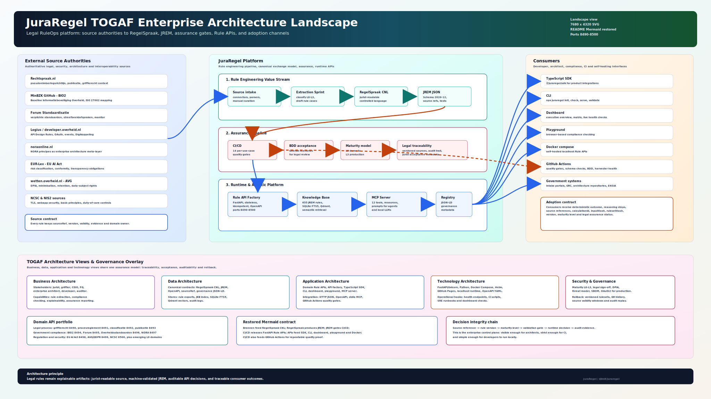
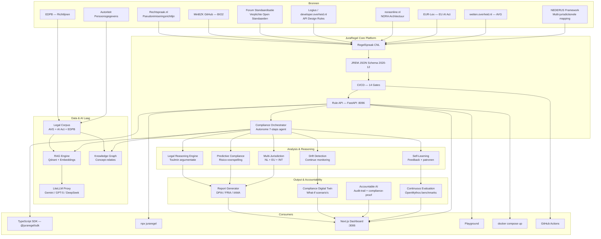

# JuraRegel — Legal Engineering Platform

[](https://github.com/djimit/juraregel/actions/workflows/juraregel-ci.yml)
[](https://opensource.org/licenses/MIT)
[](https://github.com/djimit/juraregel)
[](https://github.com/djimit/juraregel)
[](https://github.com/djimit/juraregel)
[](https://github.com/djimit/juraregel)
[](https://github.com/djimit/juraregel)
[](https://github.com/djimit/juraregel)
[](https://github.com/djimit/juraregel)

<p align="center">
  <a href="docs/assets/juraregel-togaf-landscape.svg">
    
  </a>
  <br />
  <sub><a href="docs/assets/juraregel-togaf-landscape.png">PNG 7680x4320</a> · <a href="docs/assets/juraregel-togaf-landscape.svg">SVG source</a></sub>
</p>

> **Juridische regels die juristen schrijven en computers begrijpen.**
>
> **[🎮 Probeer de Playground](https://djimit.github.io/juraregel/)** — compliance checking in je browser, geen installatie nodig.

JuraRegel is een open-source platform voor het beheren, valideren, versioneren en serveren van administratief-juridische regels. Het vertaalt bijvoorbeeld de [pseudonimiseringsrichtlijn](https://www.rechtspraak.nl/uitspraken/pseudonimiseringsrichtlijn) van Rechtspraak.nl en andere juridische richtlijnen naar digitale, testbare, auditeerbare regels.

> **Disclaimer:** JuraRegel is een proof-of-concept en architectuurprototype. Het is niet geschikt voor productiegebruik als juridisch besluitvormingsplatform zonder onafhankelijke juridische validatie.


## Maturity Model

JuraRegel gebruikt vier maturity-niveaus per use case:

| Niveau | Naam | Criteria | CI Gedrag |
|--------|------|----------|-----------|
| L0 | Demo | Regels voorbeeldmatig, geen externe review | Warnings toegestaan |
| L1 | PoC | Schema valideert, tests draaien, sourceRefs aanwezig | CI faalt bij errors, waarschuwt bij self-approval |
| L2 | Pilot | Onafhankelijke juridische review, evidence model, auditlog | CI faalt bij self-approval |
| L3 | Production | Legal sign-off, required checks, threat model, SBOM, OAuth2 | Volledige assurance pipeline |

Huidige status: 26 exports zijn L0 en 8 exports L1. Geen regelset is L2 of L3.

### Uitvoerbaarheidscontract

Alle JREM-sets zijn doorzoekbare catalogi. Alleen `griffierecht`, `toeslagen`,
`omgevingswet`, `basisregistraties` en `participatiewet` hebben een bewezen
`calculate`-pad. Andere `/calculate`-routes antwoorden `409 catalog_only` totdat
hun domeinspecifieke inputmodel, scenario-oracles en onafhankelijke review bestaan.
BIO2, NORA, NCSC en standaardenendpoints zijn inventarisaties; zonder aangeleverde
evidence rapporteren zij geen compliance-oordeel.

## Wat JuraRegel doet

- **Pseudonimiseringsrichtlijn Engine** — classificeert persoonsgegevens in uitspraken conform de richtlijn (particulier → pseudonimiseer, professional/organisatie/overheid → niet pseudonimiseer)
- **JREM** — Judicial Rule Exchange Model, versioned JSON Schema standaard (v1.0.0 → v1.1.0) voor juridische regels
- **Rule APIs** — vijf uitvoerbare domeinen; overige domeinen zijn expliciet catalog-only
- **MCP Server** — 12 tools + 3 resources + 3 prompts voor LLM-agents (Claude, GPT, lokale LLMs)
- **Knowledge Base** — 750 regels doorzoekbaar met SQLite FTS5; vector search is optioneel en evaluatie-pending
- **BDD Tests** — Gherkin scenarios voor legal team acceptatie (pytest-bdd)
- **BWB Harvester** — automatische wetwijziging-detectie via BWB API
- **CI/CD Gates** — 18+ gates: per-use-case (14), JKB (5), extraction (3), schema versioning, BDD, harvester health
- **RegelSpraak** — Controlled Natural Language specificaties, leesbaar door juristen

## Pseudonimiseringsrichtlijn Engine

De engine (V4.2) classificeert gedetecteerde persoonsgegevens in rechterlijke uitspraken:

| Classificatie | Actie | Voorbeeld |
|---|---|---|
| Particulier | Pseudonimiseer | Geboortedatum van eiser → `[geboortedatum]` |
| Professional | Niet pseudonimiseren | Geboortedatum van advocaat → laten staan |
| Rechtspersoon | Niet pseudonimiseren | Adres van B.V. → laten staan |
| Overheid | Niet pseudonimiseren | Adres van gemeente → laten staan |

**Evaluatiestatus**: er is nog geen onafhankelijk geannoteerde gouden standaard.
Resultaten zijn indicatief, niet juridisch bindend; zie [het AI-evaluatiecontract](docs/ai-evaluation-contract.md).

De engine implementeert de uitzonderingen uit de pseudonimiseringsrichtlijn:
- Professionals bij de procedure (advocaten, notarissen, deurwaarders) → niet pseudonimiseren
- Personen handelend in professionele functie → niet pseudonimiseren
- Rechtspersonen en overheidsorganisaties → niet pseudonimiseren
- Per rechtsgebied verschillende regels (familierecht = strenger, strafrecht = strenger voor particulieren)

## Waarom JuraRegel?

| Aspect | Handmatige compliance check | Commerciële GRC tools | **JuraRegel** |
|---|---|---|---|
| Prijs | €0 (maar uren werk) | €10K-€100K/jaar | **€0 (open-source)** |
| Bronverwijzing per regel | Handmatig | Soms | **Altijd (JREM sourceRef)** |
| Testbaarheid | Geen | Beperkt | **Executable scenario- en semantiekgates** |
| Uitleg aan burgers | Niet mogelijk | Niet mogelijk | **Redeneerstappen + bronverwijzing** |
| Versiebeheer | Excel/version control | Vendor-locked | **Git + JREM versioning** |
| Developer SDK | Niet beschikbaar | Vendor-locked | **TypeScript SDK (MIT)** |
| Zelf hosten | n.v.t. | Cloud-only | **Docker compose (localhost)** |
| Rule Maturity Model | Niet | Niet | **L0-L3 classificatie** |
| NORA compliance | Niet | Soms | **NORA matrix (15 principes)** |
| Pseudonimisering | Handmatig | Niet | **V4.2 pilot, onafhankelijke evaluatie pending** |

## Use Case: Griffierecht

**Als** griffier **wil ik** bij zaakintake automatisch het correcte griffierecht bepalen **zodat** ik niet handmatig tarieven hoeft op te zoeken en fouten voorkom.

| Rol | Probleem | Oplossing |
|---|---|---|
| Griffier | Verschillende tarieven per zaakstroom, partijtype en vorderingwaarde — foutgevoelig | Rule API berekent bedrag met bronverwijzing en redeneerstappen |
| Burger | Begrijpt niet waarom een bepaald bedrag geldt | API retourneert uitleg: "vordering €125.000 → categorie >€100K-≤€1M → tarief 2026: €2.803. Bron: Wgbz art. 2" |
| Advocaten | Moeten griffie bellen voor tariefbevestiging | Directe berekening via API of portaal |
| Financieel beheer | Geen audit trail van griffierecht-berekeningen | Elke berekening heeft inputHash, rulesetHash, timestamp |

- 18 JREM regels voor civiele dagvaardingszaken (kanton + handel)
- Executable scenario-, bron- en semantiekgates — Rule API op `localhost:8490`
- Juridische context in elke response (wet, BWBR-id, accordering)

### Voorbeeld

```bash
curl -X POST http://127.0.0.1:8490/v1/griffierecht/calculate \
  -H "Content-Type: application/json" \
  -d '{
    "calculationDate": "2026-07-03",
    "zaak": {
      "rechtsgebied": "civiel",
      "zaakstroom": "handel",
      "procedureType": "dagvaarding",
      "vorderingWaarde": 125000,
      "bijzondereCategorie": "geen"
    },
    "partij": {
      "rol": "eiser",
      "partijType": "natuurlijk_persoon",
      "onvermogend": false,
      "verweerStatus": "n.v.t."
    }
  }'
```

## Use Case: BIO2 — Baseline Informatiebeveiliging Overheid

**Als** CISO van een overheidsorganisatie **wil ik** automatisch valideren of mijn organisatie voldoet aan de BIO2 maatregelen **zodat** ik niet handmatig 167 maatregelen hoef te checken en ENSIA-rapportage foutloos is.

| Rol | Probleem | Oplossing |
|---|---|---|
| CISO | 167 BIO2 maatregelen handmatig bijhouden | Evidence-rapport groepeert aangeleverde beoordelingen per maatregel |
| Bestuurder | Onduidelijk welke maatregelen nog open staan | Compliance rapport: per categorie score + totaal % compliant |
| CIP | Geen gestandaardiseerd controle-instrument voor alle entiteiten | JuraRegel als open-source compliance tool — één standaard |
| ENSIA-verantwoordelijke | Handmatige rapportage is tijdrovend en inconsistent | `GET /v1/bio2/rapport/{orgId}` genereert ENSIA-gealigned rapport |
| Auditor | Geen audit trail van compliance-beslissingen | Elke check heeft calculationId, inputHash, rulesetHash, timestamp |

De [BIO2](https://www.bio-overheid.nl/category/producten/bio) is het normenkader voor informatiebeveiliging binnen alle overheidsentiteiten, gebaseerd op ISO 27001/27002. De 167 maatregelen staan op [GitHub (MinBZK)](https://github.com/MinBZK/Baseline-Informatiebeveiliging-Overheid).

- **162 overheidsmaatregelen** geparsed van MinBZK GitHub (5 zijn ISO-only)
- 4 categorieën: organisatorisch (72), technologisch (66), fysiek (17), mensgericht (12)
- Elke maatregel gekoppeld aan ISO 27002 clause (bronverwijzing)
- Rule API op `localhost:8494` — ENSIA-gealigned compliance rapport
- Catalogus + evidence store; geen compliance-oordeel zonder evidence

### Voorbeeld

```bash
# Lijst alle maatregelen
curl http://127.0.0.1:8494/v1/bio2/maatregelen

# Compliance rapport per organisatie
curl http://127.0.0.1:8494/v1/bio2/rapport/gemeente-amsterdam
```

## Use Case: Forum Standaardisatie — Verplichte Open Standaarden

**Als** architect van een overheidsorganisatie **wil ik** automatisch valideren of mijn organisatie de verplichte open standaarden toepast **zodat** ik niet handmatig de Forum Standaardisatie lijst hoef te checken en Monitor-rapportage foutloos is.

| Rol | Probleem | Oplossing |
|---|---|---|
| Architect | 22 standaarden handmatig bijhouden | Doorzoekbare, versieerbare standaardencatalogus |
| CIO | Onduidelijk welke verplichte standaarden ontbreken | Compliance rapport per categorie |
| Forum Standaardisatie | Geen gestandaardiseerd controle-instrument | JuraRegel als open-source compliance tool |
| Monitor-verantwoordelijke | Handmatige rapportage inconsistent | `GET /v1/fs/rapport/{orgId}` — Monitor aligned |

De [Forum Standaardisatie](https://www.forumstandaardisatie.nl/open-standaarden/verplicht) beheert de lijst van verplichte open standaarden voor de hele Nederlandse overheid — van OAuth en SAML tot DKIM en PDF.

- **22 standaarden** (16 verplicht + 6 streefbeeld) in 4 categorieën
- Interoperabiliteit (OAuth, SAML, OData, StUF, ebMS), Veiligheid (DKIM, DMARC, SPF, TLS, DNSSEC), Document (PDF, OOXML, ODF, eFactuur), Identiteit (eIDAS, iGOV)
- Rule API op `localhost:8495` met standaarden listing en Monitor aligned rapport
- Catalogusendpoint; geen compliance-oordeel zonder evidence

### Voorbeeld

```bash
# Lijst alle verplichte standaarden
curl http://127.0.0.1:8495/v1/fs/standaarden?status=verplicht

# Monitor Open Standaarden rapport
curl http://127.0.0.1:8495/v1/fs/rapport/ministerie-bzk
```

## Use Case: Overheidsstandaarden — API, Authenticatie en Events

**Als** API architect bij een overheidsorganisatie **wil ik** automatisch valideren of mijn APIs en services voldoen aan de Logius en Forum Standaardisatie standaarden **zodat** ik niet handmatig regels hoef te checken en developer.overheid.nl registratie foutloos is.

| Rol | Probleem | Oplossing |
|---|---|---|
| API architect | API Design Rules handmatig per endpoint | Doorzoekbare regelcatalogus met bronverwijzingen |
| Security engineer | OAuth/OIDC profiel incompleet | Check NL GOV Assurance Profile OAuth 2.0 |
| Event architect | CloudEvents niet conforme | Check NL GOV Profile for CloudEvents |
| Integratie architect | Digikoppeling protocol onduidelijk | Check WUS/ebMS/certificaat regels |

24 standaarden uit [Logius](https://logius-standaarden.github.io/API-Design-Rules/), [Forum Standaardisatie](https://www.forumstandaardisatie.nl/open-standaarden/authenticatie-standaarden) en [developer.overheid.nl](https://developer.overheid.nl/):

- **API Design** (14): RESTful, HAL, JSON, camelCase, self-link, error responses, versioning, pagination, CORS, HTTPS
- **Authenticatie** (4): OAuth 2.0 NL GOV Assurance Profile, eIDAS SAML, OpenID Connect, JWT
- **Events** (3): CloudEvents structured mode, extensies
- **Digikoppeling** (3): WUS 3.0, ebMS 3.0, PKIoverheid certificaten
- Catalogusendpoint op `localhost:8496`; `calculate` is geblokkeerd

### Voorbeeld

```bash
# Lijst alle API Design Rules
curl http://127.0.0.1:8496/v1/os/standaarden?categorie=api-design

# Compliance rapport
curl http://127.0.0.1:8496/v1/os/rapport/ministerie-bzk
```

## Use Case: NORA — Architectuur Compliance (Meta-laag)

**Als** enterprise architect bij een overheidsorganisatie **wil ik** automatisch valideren of mijn oplossing voldoet aan NORA principes **zodat** ik NORA compliance kan bewijzen met verwijzingen naar specifieke use cases.

| Rol | Probleem | Oplossing |
|---|---|---|
| Enterprise architect | NORA-principes handmatig beheren | Catalogus en matrix van 15 principes |
| CIO | Onduidelijk welke principes open staan | NORA compliance matrix met use case mapping |
| TOGAF architect | Principes niet gekoppeld aan implementatie | Matrix mapped principes → JuraRegel use cases |

NORA is de **overkoepelende architectuurlaag** die alle use cases verbindt. 15 principes in 5 categorieën (architectuur, serviceorientatie, beveiliging, identiteit, data). Rule API op `localhost:8497` met `GET /v1/nora/matrix` voor compliance matrix.

## Use Case: EU AI Act — AI-systeem Compliance

**Als** AI-developer **wil ik** automatisch valideren of mijn AI-systeem voldoet aan de EU AI Act **zodat** ik niet handmatig 12 artikelen hoef te checken.

| Rol | Probleem | Oplossing |
|---|---|---|
| AI developer | Onbekend welke verplichtingen van toepassing zijn | Rule API classificeert: verboden/hoog/beperkt/minimaal |
| Compliance officer | Conformity assessment onduidelijk | Check art. 9-12 + 43 |

12 regels (classificatie, conformity, transparantie, rechten). Rule API op `localhost:8498`. Bron: EUR-Lex.

## Use Case: Judicial AI Assurance — Rechtspraak onder menselijke regie

**Als** rechterlijke governance- of assurancefunctie **wil ik** per AI-use-case
aantoonbare, niet-compenseerbare controles **zodat** efficiëntiewinst nooit
rechterlijke autonomie, toegang tot een menselijke rechter of betwistbaarheid vervangt.

Het catalog-only profiel bevat 12 controls, waaronder 9 hard stops voor onder
meer rechterlijke bevoegdheid, niet-bindende AI-uitvoer, equality of arms,
bronherleidbaarheid, publieke regie en formele handelingsbevoegdheid. De vier
CEPEJ-landenpresentaties zijn uitsluitend als contextbron geregistreerd. De API
op `localhost:8521` retourneert voor berekeningen bewust `409 catalog_only`.
Zie het [bouw- en assurancecontract](goals/juraregel-judicial-ai-assurance/GOAL.md).

De statische [Judicial AI Admission & Evidence Gate](playground/judicial-ai.html)
laat drie synthetische scenario's zien en verbindt het profiel met
provider-neutrale OpenMythos- en Djimitflo-evidence. De demo berekent geen
compliancescore: ontbrekende of gefaalde hard-stop-evidence blokkeert, en zonder
een versiegebonden menselijke eindbeslissing blijft de uitkomst
`review-required`. Zie het [integratie- en verificatiecontract](docs/judicial-ai-admission-demo.md).

## Use Case: AVG/GDPR — Privacy Compliance

**Als** privacy officer of FG **wil ik** automatisch valideren of mijn organisatie voldoet aan de AVG **zodat** ik niet handmatig 10 artikelen hoef te checken.

| Rol | Probleem | Oplossing |
|---|---|---|
| Privacy officer | DPIA vereisten onduidelijk | Check art. 35 |
| FG | Bewaartermijnen niet systematisch | Check art. 5 lid 1e |
| Web developer | Rechten van betrokkenen onbekend | Check art. 12-22 |

10 regels (DPIA, bewaartermijn, rechten, minimisation). Rule API op `localhost:8499`. Bron: wetten.overheid.nl (UAVG).

## Use Case: NEDERUS — Multi-Jurisdictional AI Compliance Mapping

**Als** compliance officer bij een overheidsorganisatie **wil ik** één set controls die tegelijkertijd voldoet aan EU AI Act, BIO2, NIS2 en NORA **zodat** ik niet vier aparte compliance-processen hoef te draaien.

| Rol | Probleem | Oplossing |
|---|---|---|
| Compliance officer | 4 frameworks × eigen risicoanalyse, eigen rapportage | NEDERUS unified controls: één assessment, vier dekkingen |
| CISO | BIO2 + NIS2 overlappen maar gebruiken andere terminologie | NEDERUS mapping toont exact welke maatregelen overlappen |
| Enterprise architect | NORA principes niet direct gekoppeld aan EU AI Act vereisten | NEDERUS koppelt NORA grondslagen aan EU AI Act artikelen |
| AI developer | Onbekend of AI-systeem aan alle kaders voldoet | NED-01 t/m NED-05 als startpunt voor compliance review |

NEDERUS (Nederlandse Unified AI Standards) is een open framework dat 5 unified controls definieert die **alle vijf** dekken: NIST AI RMF (functioneel), EU AI Act (wettelijk), BIO2 (beveiliging), NIS2 (cybersecurity), NORA (architectuur).

### NEDERUS Controls in JuraRegel

| NEDERUS Control | JuraRegel Use Cases | Frameworks |
|---|---|---|
| NED-01 AI Impact Assessment | EU AI Act, NORA, BIO2, NIS2 | All 4 |
| NED-02 Bias & Fairness Testing | EU AI Act, NORA | EU AI Act + NORA |
| NED-03 Human Oversight | EU AI Act, NORA | EU AI Act + NORA |
| NED-04 Transparency | EU AI Act, NORA | EU AI Act + NORA |
| NED-05 Incident Response | EU AI Act, BIO2, NIS2 | 3 frameworks |

- **Repository**: [github.com/djimit/nederus-framework](https://github.com/djimit/nederus-framework)
- **Frameworks**: NIST RMF, EU AI Act, BIO2, NIS2, NORA, CRA, DSA, AI Liability Directive
- **Crosswalks**: 8 per-framework documenten met artikel-niveau verwijzingen
- **Validation**: Structural (CI) + Tier classification (≥3 = priority) + Operational (pilot)
- **MCP Tools**: `nederus.list_controls`, `nederus.get_control`, `nederus.crosswalk`, `nederus.lookup`
- **License**: CC-BY 4.0

### NEDERUS v2.0 Framework Matrix

| | NIST | EU AI Act | BIO2 | NIS2 | NORA | CRA | DSA | AI Liability |
|---|------|-----------|------|------|------|-----|-----|-------------|
| NED-01 Impact Assessment | ✅ | ✅ | ◐ | ◐ | ◐ | ◐ | — | ◐ |
| NED-02 Bias & Fairness | ✅ | ✅ | — | — | ◐ | — | ◐ | ◐ |
| NED-03 Human Oversight | ✅ | ✅ | — | — | ◐ | — | — | ◐ |
| NED-04 Transparency | ✅ | ✅ | — | — | ◐ | ◐ | ✅ | ◐ |
| NED-05 Incident Response | ✅ | ✅ | ✅ | ✅ | — | ✅ | ◐ | ◐ |
| NED-06 Secure Development | ◐ | ◐ | ✅ | ◐ | ◐ | ✅ | — | ◐ |
| NED-07 Platform Transparency | ◐ | ◐ | — | — | ◐ | — | ✅ | ◐ |
| NED-08 AI Liability | ◐ | ✅ | ◐ | ◐ | ◐ | ◐ | ◐ | ✅ |

> ✅ = equivalent · ◐ = partial | — = gap | Based on NEDERUS v2.0 controls.yaml

### Voorbeeld: Unified Impact Assessment

```bash
# NED-01: Één assessment, vier frameworks
# EU AI Act Art. 9(2) + Art. 27 (FRIA)
# BIO2 A.5-6 (Risicoanalyse)
# NIS2 Art. 21 (Risk management)
# NORA Grondslag-toets

curl http://127.0.0.1:8498/v1/eu-ai-act/classify \
  -d '{"systemType": "high-risk", "domain": "public-services"}'
# → classification + linked NEDERUS controls + per-framework requirements
```

## Use Case: NCSC — ICT-beveiligingsrichtlijnen

**Als** security engineer **wil ik** automatisch valideren of mijn systemen voldoen aan de NCSC ICT-beveiligingsrichtlijnen **zodat** ik niet handmatig 32 richtlijnen hoef te checken.

| Rol | Probleem | Oplossing |
|---|---|---|
| Security engineer | 32 NCSC richtlijnen handmatig | Catalogus van richtlijnen; beoordeling vereist externe evidence |
| CISO | Onbekend wat open staat | Compliance rapport per categorie (TLS, webapp, basisprincipes) |
| Web developer | Webapp richtlijnen onduidelijk | Check input validatie, output encoding, CSRF, CSP |
| SRE-er | TLS richtlijnen niet systematisch | Check TLS 1.2+, cipher suites, HSTS, cert pinning |

32 richtlijnen uit [NCSC](https://www.ncsc.nl/basisprincipes): TLS (8), Webapplicaties (10), Basisprincipes (14). Rule API op `localhost:8500`.

### Voorbeeld

```bash
# Lijst alle TLS richtlijnen
curl http://127.0.0.1:8500/v1/ncsc/richtlijnen?categorie=tls

# Compliance rapport
curl http://127.0.0.1:8500/v1/ncsc/rapport/gemeente-amsterdam
```

## Product Features

### Docker Compose
```bash
docker compose up  # Start griffierecht en publicatie
```

### CLI: Nieuwe Use Case Scaffolden
```bash
bash juraregel-init.sh avg 8498  # Scaffold een AVG use case op port 8498
```

### GitHub Actions CI
```yaml
# In je eigen repo:
jobs:
  juraregel:
    uses: djimit/juraregel/.github/workflows/juraregel-ci.yml@main
    with:
      use-case: 'all'
```

### Dashboard
Open `dashboard/index.html` voor een historisch catalogusoverzicht; alleen de in het uitvoerbaarheidscontract genoemde diensten mogen als rekenservice worden behandeld.

### Contributing
Zie [CONTRIBUTING.md](CONTRIBUTING.md) voor de use case template en bijdrage richtlijnen.

### NORA Compliance Matrix
Zie [docs/nora-compliance-matrix.md](docs/nora-compliance-matrix.md) voor de Mermaid diagram met NORA principes → use case mapping.

## Voor elk rol in het functiehuis Rijksoverheid

| Rol | Wat JuraRegel biedt | Start hier |
|---|---|---|
| AI Engineer | EU AI Act regelcatalogus | [EU AI Act use case](docs/eu-ai-act-use-case.md) |
| Identity Architect | eIDAS 2.0 wallet + vertrouwensdiensten | [eIDAS use case](docs/eidas-use-case.md) |
| Data Engineer | AVG data minimisation, bewaartermijnen | [AVG use case](docs/avg-gdpr-use-case.md) |
| Software Ontwikkelaar | TypeScript SDK, CLI, OpenAPI, code examples | [SDK README](sdk/typescript/README.md), [examples](docs/examples/) |
| Solution Architect | NORA matrix, API Design Rules, ADR template | [NORA use case](docs/nora-use-case.md), [ADR template](docs/templates/adr-template.md) |
| Security Expert | BIO2 (162), NCSC (32), threat model template | [BIO2](docs/bio2-use-case.md), [NCSC](docs/ncsc-use-case.md), [threat model](docs/templates/threat-model-template.md) |
| DevOps Engineer | Docker compose, GitHub Actions | [Docker](#docker), [CI](.github/workflows/) |
| SRE | Health endpoints, Grafana dashboard, runbook | [Grafana](docs/sre/grafana-dashboard.json), [runbook](docs/sre/runbook-template.md) |
| Tester | Scenario-, bron-, compile-, API- en MCP-gates | [CONTRIBUTING](CONTRIBUTING.md), [user story template](docs/templates/user-story-template.md) |
| Product Owner | Compliance rapporten, ROI template, comparison | [Comparison table](#waarom-juraregel), [user story template](docs/templates/user-story-template.md) |
| Enterprise Architect | NORA compliance matrix, TOGAF mapping, C4 | [NORA matrix](docs/nora-compliance-matrix.md), [ADR template](docs/templates/adr-template.md) |
| Compliance Officer | Frameworkinventaris en evidence-gaten, multi-jurisdictionele mapping | [Executive dashboard](dashboard/executive.html), [Postman](docs/juraregel-postman-collection.json), [NEDERUS Framework](https://github.com/djimit/nederus-framework) |
| CISO | BIO2 + NCSC + Cybersecuritybeeld 2025 | [Executive dashboard](dashboard/executive.html), [NCSC](docs/ncsc-use-case.md) |
| Jurist | RegelSpraak CNL, bronverwijzingen, acceptatie | [Rule Extraction Sprint](docs/rule-extraction-sprint.md), [maturity model](docs/maturity-model.md) |
| Privacy Officer | AVG/GDPR regels, DPIA template | [AVG use case](docs/avg-gdpr-use-case.md), [DPIA template](docs/templates/dpia-template.md) |
| Beleidsmedewerker | NORA principes, Forum Standaardisatie | [NORA](docs/nora-use-case.md), [Forum Standaardisatie](docs/forumstandaardisatie-use-case.md) |

### Templates & Tooling

| Wat | Waar | Voor wie |
|---|---|---|
| ADR template | [docs/templates/adr-template.md](docs/templates/adr-template.md) | Architecten |
| Threat model template | [docs/templates/threat-model-template.md](docs/templates/threat-model-template.md) | Security experts |
| DPIA template | [docs/templates/dpia-template.md](docs/templates/dpia-template.md) | Privacy officers |
| User story template | [docs/templates/user-story-template.md](docs/templates/user-story-template.md) | Product owners |
| Grafana dashboard | [docs/sre/grafana-dashboard.json](docs/sre/grafana-dashboard.json) | SRE |
| Runbook template | [docs/sre/runbook-template.md](docs/sre/runbook-template.md) | SRE |
| Postman collection | [docs/juraregel-postman-collection.json](docs/juraregel-postman-collection.json) | Ontwikkelaars |
| Code examples | [docs/examples/](docs/examples/) — Python, Java, C#, Go, TypeScript | Ontwikkelaars |
| Executive dashboard | [dashboard/executive.html](dashboard/executive.html) | C-level |
| Compliance matrix | [shared/compliance_matrix.py](shared/compliance_matrix.py) | Compliance officers |

## Installatie

### TypeScript SDK
```bash
npm install --prefix sdk/typescript
npm --prefix sdk/typescript run build
```
De SDK is lokaal en exporteert alleen de uitvoerbare `GriffierechtClient`.

### CLI
```bash
npm run init -- avg 8500       # Lokale repo-tool; het npm-package wordt niet gepubliceerd
npm run check                  # Run CI gates
npm run serve -- griffierecht # Start API
node bin/juraregel.mjs validate use-cases/griffierecht/jrem/exports/griffierecht-civiel-2026.1.json
```

### Docker
```bash
docker compose up  # Start griffierecht :8490 en publicatie :8493
```

### Dashboard
Open `dashboard/index.html` voor een visueel overzicht met live health checks.

## Architectuur



### Use Case Maturity

| Use case | Regels | Status | Poort |
|---|---|---|---|
| Griffierecht | 36 | **PoC** | 8490 |
| BIO2 | 162 | **PoC** | 8494 |
| Forum Standaardisatie | 22 | **PoC** | 8495 |
| Overheidsstandaarden | 24 | **PoC** | 8496 |
| NORA | 15 | **PoC** | 8497 |
| EU AI Act | 12 | PoC | 8498 |
| Judicial AI Assurance | 12 | **PoC, catalog-only** | 8521 |
| ADR ITGC-kader v1.1 | 48 | **L1-PoC, catalog-only** | 8522 |
| AVG/GDPR | 10 | PoC | 8499 |
| NCSC | 32 | PoC | 8500 |
| **eIDAS 2.0** | **32** | **PoC** | **8523** |
| **BIA-BIV-DPIA** | **32** | **PoC** | **8524** |
| **DPIA Generator** | **51** | **PoC** | **8525** |
| **ISO 27001 ISMS** | **28** | **PoC** | **8526** |
| **Wet Digitale Overheid** | **16** | **PoC** | **8528** |
| **ISO 25010** | **35** | **PoC** | **8529** |
| **ISO 27002** | **34** | **PoC** | **8530** |
| **ISO 27701** | **24** | **PoC** | **8531** |
| **ISO 22301** | **24** | **PoC** | **8532** |
| **ISO 31000** | **21** | **PoC** | **8533** |
| **ISO 9001** | **27** | **PoC** | **8534** |
| **NEN 7510** | **15** | **PoC** | **8535** |
| **NIST CSF 2.0** | **24** | **PoC** | **8536** |
| **ISO 20000** | **16** | **PoC** | **8537** |
| **PCI-DSS v4.0** | **12** | **PoC** | **8538** |
| **COBIT 2019** | **12** | **PoC** | **8539** |
| **SOC 2** | **16** | **PoC** | **8540** |
| **NIS2 Volledig** | **24** | **PoC** | **8541** |
| **ISO 14001** | **16** | **PoC** | **8542** |
| **ISO 45001** | **17** | **PoC** | **8543** |
| **BDI** | **14** | **PoC** | **8544** |
| **Algoritmeregister + FRIA** | **20** | **PoC** | **8545** |
| **NEDERUS** | **8 unified controls** | **v2.0 (external repo)** | **—** |
| Procesreglement | 4 | PoC | 8491 |
| Classificatie | 3 | PoC | 8492 |
| Publicatie/PII | 3 | **PoC** (engine V4.2) | 8493 |

├── griffierecht/         Eerste use case (bewezen PoC)
├── procesreglement/      UC-02: Digitale indiening
├── classificatie/        UC-03: Zaakclassificatie
└── publicatie/           UC-06: Pseudonimiseringsrichtlijn engine
shared/
├── api_base.py           Factory pattern: create_app(domain, jrem_path, port)
├── jrem-schema.json      JSON Schema 2020-12 (open standaard)
├── validate.py           JREM validator
└── registry.py           Multi-domein index
ci/
├── run-gates.sh          14 CI gates per use case
├── run-all-gates.sh      CI driver voor alle use cases
└── acceptatie-check.py   Gate 14: jurist-acceptatie
```

## Pseudonimiseringsrichtlijn Engine bestanden

| Bestand | Beschrijving |
|---|---|
| `use-cases/publicatie/lib/richtlijn_engine_v4.py` | Enige actuele engine; onafhankelijke evaluatie pending |
| `use-cases/publicatie/regelspraak/pseudonimiseringsrichtlijn.rspraak` | 17 RegelSpraak regels conform richtlijn |
| `use-cases/publicatie/tests/test_richtlijn_engine.py` | Gerichte regressietests voor de actuele engine |

## Installatie

```bash
git clone https://github.com/djimit/juraregel.git
cd juraregel
python3 -m venv .venv
source .venv/bin/activate
pip install fastapi uvicorn pydantic jsonschema pytest httpx

# Run tests
python3 -m pytest use-cases/*/tests/ -v

# Start griffierecht API
python3 use-cases/griffierecht/api/app.py
# → http://127.0.0.1:8490/v1/health

# Open demo
open demo/index.html

# Run CI gates
bash ci/run-all-gates.sh
```

## JREM Open Standaard

JREM (Judicial Rule Exchange Model) is een open JSON Schema (draft 2020-12) voor het structureren van juridische regels:

- Regels met voorwaarden, uitkomsten en bronverwijzingen
- Ingebedde test scenario's
- Versiebeheer met geldigheidsperiodes
- Metadata met juridische context en jurist-acceptatie

Zie `jrem-open-source/` voor het standalone JREM schema, validator en examples.

## Validatie

| Metriek | Waarde |
|---|---|
| Use cases | 35 use cases + NEDERUS v2.0 multi-jurisdictionele mapping |
| Tests | Semantische scenario-, bron-, API-, BDD-, MCP-gates + 52 eIDAS tests |
| CI gates | 14 per use case |
| JREM regels | 1137+ (incl. alle ISO, NIST, PCI, COBIT, SOC, NEN, BDI, NIS2-normen) |
| Pseudonimisering engine | V4.2 — hoog op 25.127 uitspraken |
| Open standaarden | 9 compliant (+ eIDAS 2.0, NEDERUS CC-BY) |
| NEDERUS controls | 8 unified controls (NED-01 t/m NED-08), 8 frameworks gemapped |
| eIDAS regels | 32 regels, 21 categorieën, 8 frameworks |
| MCP tools | 16 tools (incl. nederus.list/get/crosswalk/lookup + bia-biv-dpia + dpia-generator) |

## Licentie

MIT — zie [LICENSE](LICENSE)

## Bijdragen

Zie [CONTRIBUTING.md](CONTRIBUTING.md) (JREM open-source) voor bijdrage richtlijnen.

## Bronverwijzingen

- [Pseudonimiseringsrichtlijn — Rechtspraak.nl](https://www.rechtspraak.nl/uitspraken/pseudonimiseringsrichtlijn)
- [Wet griffierechten burgerlijke zaken (Wgbz) — wetten.overheid.nl](https://wetten.overheid.nl/BWBR0035817/)
- [Wet RO — wetten.overheid.nl](https://wetten.overheid.nl/BWBR0004701/)
- [Rechtspraak Open Data API — data.rechtspraak.nl](https://data.rechtspraak.nl/)

## Over Djimit Rules

JuraRegel is ontwikkeld door [Djimit Rules](https://github.com/djimit) als onderdeel van het Legal RuleOps Platform. De openbare data van de Rechtspraak is de pilot mee gedaan. JuraRegel is herbruikbaar bij elke overheidsorganisatie die met administratief juridische regels werkt.
