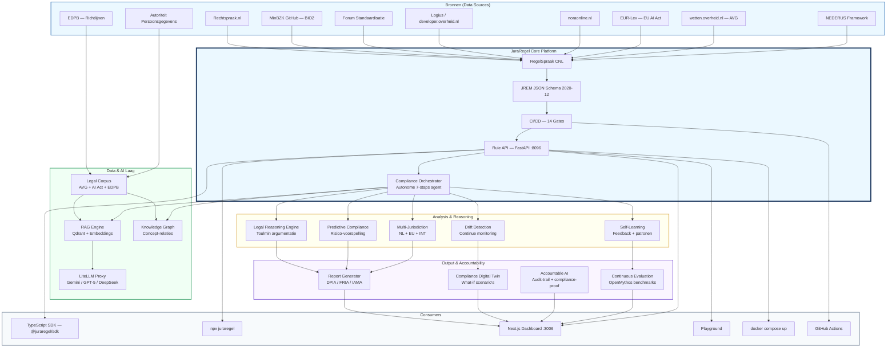

# TOGAF Landscape Diagram — Generatie Prompt

## Doel

Genereer een professioneel TOGAF-enterprise architecture landscape diagram (7680x4320 PNG) voor het JuraRegel Legal Engineering Platform.

## Diagram Specificaties

### Formaat
- **Resolutie**: 7680 x 4320 pixels (16:9, 4K+)
- **Formaat**: PNG met transparante achtergrond
- **Stijl**: TOGAF-compliant enterprise architecture diagram
- **Kleurpalet**:
  - Bronnen: `#2b6cb0` (blauw)
  - Data & AI Laag: `#38a169` (groen)
  - Core Platform: `#1a365d` (donkerblauw)
  - Analysis & Reasoning: `#d69e2e' (oranje)
  - Output & Accountability: `#805ad5` (paars)
  - Consumers: `#718096` (grijs)

### Structuur (top-down, 6 lagen)

```
┌─────────────────────────────────────────────────────────────────────────────┐
│                        BRONNEN (Data Sources)                                │
│  Rechtspraak.nl | MinBZK BIO2 | Forum Standaardisatie | Logius | NORA      │
│  EUR-Lex | wetten.overheid.nl | NEDERUS | EDPB | AP                         │
├─────────────────────────────────────────────────────────────────────────────┤
│                     DATA & AI LAAG (Knowledge Layer)                         │
│  RAG Engine | LiteLLM Proxy | Knowledge Graph | Legal Corpus               │
├─────────────────────────────────────────────────────────────────────────────┤
│                     JURARECEL CORE PLATFORM                                 │
│  RegelSpraak CNL | JREM Schema | CI/CD Gates | Rule API | Orchestrator     │
├─────────────────────────────────────────────────────────────────────────────┤
│                     ANALYSIS & REASONING                                     │
│  Legal Reasoning | Predictive Compliance | Drift Detection | Multi-Juris   │
├─────────────────────────────────────────────────────────────────────────────┤
│                     OUTPUT & ACCOUNTABILITY                                  │
│  Report Generator | Digital Twin | Accountable AI | Continuous Evaluation  │
├─────────────────────────────────────────────────────────────────────────────┤
│                     CONSUMERS                                                │
│  TypeScript SDK | CLI | Dashboard | Playground | Docker | GitHub Actions   │
└─────────────────────────────────────────────────────────────────────────────┘
```

### Edges (Data Flow)

**Bronnen → Data & AI:**
- EDPB → Legal Corpus
- AP → Legal Corpus
- EUR-Lex → Legal Corpus (via RAG)
- wetten.overheid.nl → Legal Corpus (via RAG)

**Bronnen → Core:**
- Rechtspraak.nl → RegelSpraak
- MinBZK BIO2 → RegelSpraak
- Forum Standaardisatie → RegelSpraak
- Logius → RegelSpraak
- NORA → RegelSpraak
- NEDERUS → RegelSpraak

**Data & AI → Analysis:**
- RAG Engine → Legal Reasoning
- Knowledge Graph → Orchestrator
- LiteLLM → RAG Engine

**Core → Analysis:**
- Orchestrator → Legal Reasoning
- Orchestrator → Predictive Compliance
- Orchestrator → Drift Detection
- Orchestrator → Multi-Jurisdiction
- Orchestrator → Self-Learning

**Analysis → Output:**
- Legal Reasoning → Report Generator
- Predictive Compliance → Report Generator
- Multi-Jurisdiction → Report Generator
- Drift Detection → Digital Twin
- Self-Learning → Continuous Evaluation

**Core → Consumers:**
- Rule API → TypeScript SDK
- Rule API → CLI
- Rule API → Dashboard
- Rule API → Playground
- Rule API → Docker Compose
- CI/CD → GitHub Actions

### Node Stijlen

| Laag | Vorm | Border | Fill | Text |
|------|------|--------|------|------|
| Bronnen | Ronde rechthoek | 3px solid | Licht | Wit |
| Data & AI | Hexagon | 3px solid | Licht | Wit |
| Core Platform | Rechthoek met schaduw | 4px solid | Medium | Wit |
| Analysis | Ronde rechthoek | 2px solid | Licht | Zwart |
| Output | Rechthoek | 2px solid | Licht | Zwart |
| Consumers | Pilvorm | 2px solid | Licht | Wit |

### Labels & Annotaties

**Module Labels (in elk node):**
- Naam (bold)
- Korte beschrijving (kleiner)
- Poort/versie indien van toepassing

**Edge Labels:**
- Data flow type (JSON, REST, GraphQL, etc.)
- Protocol indien relevant

**Laag Headers:**
- Elke laag heeft een header-label linksboven
- Lettergrootte: 24px, bold, laag-kleur

### Technische Details

- **Font**: Inter, system-ui, of Arial
- **Node grootte**: Minimaal 200x80 pixels
- **Edge dikte**: 2px solid, 1px bij sub-flows
- **Afstand tussen lagen**: 120 pixels
- **Afstand tussen nodes**: 60 pixels
- **Marge**: 80 pixels aan alle kanten
- **Achtergrond**: Wit (`#ffffff`) of licht grijs (`#f7fafc`)

### Iconen (optioneel maar aanbevolen)

Gebruik Material Design Icons of Font Awesome:
- Bronnen: `fa-database` / `mdi-database`
- RAG: `fa-brain` / `mdi-brain`
- LLM: `fa-robot` / `mdi-robot`
- Knowledge Graph: `fa-project-diagram` / `mdi-graph`
- API: `fa-server` / `mdi-server`
- Reports: `fa-file-alt` / `mdi-file-document`
- Dashboard: `fa-chart-line` / `mdi-chart-line`
- Docker: `fa-docker` / `mdi-docker`

### Output Bestanden

1. **PNG**: `docs/assets/juraregel-togaf-landscape.png` (7680x4320)
2. **SVG**: `docs/assets/juraregel-togaf-landscape.svg` (editable source)
3. **Source**: Mermaid, Draw.io, of PlantUML bronbestand

### Generatie Instructies voor AI Image Generator

Als je dit diagram genereert met een AI tool (DALL-E, Midjourney, Stable Diffusion):

```
Create a professional TOGAF enterprise architecture landscape diagram for the JuraRegel Legal Engineering Platform.

Layout: Top-down, 6 horizontal layers with clear separation.
Resolution: 7680x4320 pixels, 16:9 aspect ratio.
Style: Clean, modern, enterprise architecture style with rounded rectangles and connecting arrows.

Layer 1 (Top): Data Sources
- Nodes: Rechtspraak.nl, MinBZK BIO2, Forum Standaardisatie, Logius, NORA, EUR-Lex, wetten.overheid.nl, NEDERUS, EDPB, AP
- Color: Blue (#2b6cb0)

Layer 2: Data & AI
- Nodes: RAG Engine, LiteLLM Proxy, Knowledge Graph, Legal Corpus
- Color: Green (#38a169)

Layer 3: Core Platform
- Nodes: RegelSpraak CNL, JREM Schema, CI/CD Gates, Rule API (:8096), Compliance Orchestrator
- Color: Dark Blue (#1a365d)

Layer 4: Analysis & Reasoning
- Nodes: Legal Reasoning Engine, Predictive Compliance, Drift Detection, Multi-Jurisdiction, Self-Learning
- Color: Orange (#d69e2e)

Layer 5: Output & Accountability
- Nodes: Report Generator, Digital Twin, Accountable AI, Continuous Evaluation
- Color: Purple (#805ad5)

Layer 6 (Bottom): Consumers
- Nodes: TypeScript SDK, CLI, Dashboard (:3006), Playground, Docker Compose, GitHub Actions
- Color: Gray (#718096)

Connecting arrows show data flow direction (top to bottom).
Each node has a name label and short description.
Clean white background, professional enterprise architecture style.
```

### Alternatief: Mermaid Source



### Checklist voor Review

- [ ] Alle 6 lagen zichtbaar en correct gelabeld
- [ ] Data flow arrows tonen correcte richting
- [ ] Kleuren consistent per laag
- [ ] Tekst leesbaar op 7680x4320
- [ ] Geen overlapping van nodes of edges
- [ ] Professionele uitstraling (geen cartoon-stijl)
- [ ] TOGAF-constructies herkenbaar (layers, domains, flows)
