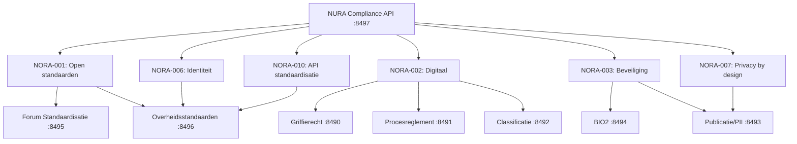

# NORA Compliance Matrix

## Architectuur Overzicht

## Principes → Use Cases Mapping

| NORA Principe | Use Case | Poort | Regels |
|---|---|---|---|
| Open standaarden | Forum Standaardisatie | 8495 | 22 |
| Open standaarden | Overheidsstandaarden | 8496 | 24 |
| Digitaal | Griffierecht | 8490 | 36 |
| Digitaal | Procesreglement | 8491 | 4 |
| Digitaal | Classificatie | 8492 | 3 |
| Beveiliging | BIO2 | 8494 | 162 |
| Beveiliging | Publicatie (PII) | 8493 | 3 |
| Identiteit | Overheidsstandaarden | 8496 | 24 |
| Privacy by design | Publicatie (PII) | 8493 | 3 |
| API standaardisatie | Overheidsstandaarden | 8496 | 24 |
| Event-driven | Overheidsstandaarden | 8496 | 24 |
| Gegevensuitwisseling | Overheidsstandaarden | 8496 | 24 |
| Sovereignty | BIO2 | 8494 | 162 |
